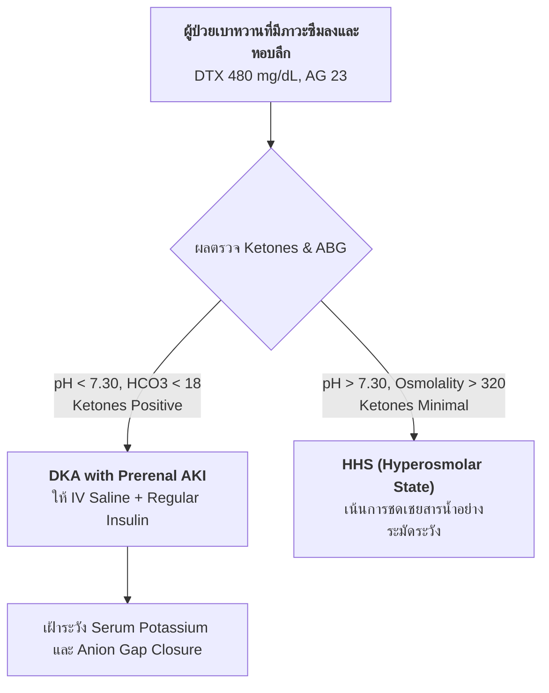

# Clinical Diagnostic Support (MedMate)

This skill assists doctors (Tier 1) and medical students (Tier 2) in generating structured differential diagnoses, ranking clinical hypotheses by likelihood, and identifying key discriminators.

---

## 1. Diagnostic Formulation Workflow

1. **Synthesize Clinical Problem List**: Summarize age, gender, cardinal symptoms, onset time, and key objective findings.
2. **Generate Broad Differential Diagnoses**: Formulate a comprehensive list of plausible etiologies covering:
   - Most common/probable conditions
   - Life-threatening "Must Not Miss" conditions (e.g., Aortic Dissection, PE, STEMI, Tension Pneumothorax)
3. **Rank by Clinical Likelihood**:
   - Primary Suspected Diagnosis (Most Likely)
   - Secondary / Alternative Differential Diagnoses
4. **Provide Grounded Justification**: Correlate each diagnosis with positive and negative findings present in the patient record.
5. **Express Clinical Uncertainty**: Maintain assistive tone; state remaining diagnostic ambiguity and suggest definitive confirmatory tests.

---

## 2. Output Format (Markdown Table & Mermaid Flowchart)

### 2.1 Problem Representation
> ผู้ป่วยชายไทยอายุ 58 ปี ประวัติเบาหวานควบคุมไม่ดี มาด้วยอาการซึมลงเฉียบพลัน หายใจหอบลึกแบบ Kussmaul ขาดน้ำรุนแรง น้ำตาลในเลือดสูง 480 mg/dL และมีภาวะ High Anion Gap Metabolic Acidosis (AG 23)

### 2.2 Differential Diagnoses Table (Markdown Table)

| ลำดับความน่าจะเป็น (Likelihood) | การวินิจฉัยแยกโรค (Diagnosis) | รหัสโรค (ICD-10) | หลักฐานทางคลินิกสนับสนุน (Supporting Evidence) | ข้อจำแนก / ยืนยัน (Discriminator / Key Tests) |
| :--- | :--- | :--- | :--- | :--- |
| **1. เป็นไปได้มากที่สุด (Most Likely)** | **Diabetic Ketoacidosis (DKA) with Prerenal AKI** | `E11.10`, `N17.9` | น้ำตาล 480 mg/dL, pH 7.15, $HCO_3^- = 9$, Urine Ketone 4+, Anion Gap 23, Kussmaul breathing | ต่างจาก HHS ตรงที่มี Acidosis ชัดเจนและคีโตนในปัสสาวะสูงมาก |
| **2. ร่วมด้วย / เหลื่อมซ้อน (Possible / Overlap)** | **Hyperosmolar Hyperglycemic State (HHS)** | `E11.00` | น้ำตาลสูงรุนแรง, ขาดน้ำมาก, ซึมสับสน | ภาวะ Acidosis รุนแรงและ High AG บ่งชี้ไปทาง DKA หรือ Mixed DKA/HHS |
| **3. ปัจจัยเสริมร่วม (Secondary Contributor)** | **Lactic Acidosis secondary to Sepsis / Dehydration** | `E87.2` | เม็ดเลือดขาวสูง, ขาดน้ำรุนแรง, ความดันโลหิตเริ่มลด | ตรวจ Serum Lactate level และ Blood hemoculture เพิ่มเติม |

### 2.3 Diagnostic Decision Algorithm (Mermaid Flowchart)

> ⚠️ **Strict Ban on ASCII Text:** ห้ามนำเสนอการวินิจฉัยแยกโรคหรืออัลกอริทึมด้วย ASCII Text Art หรือ ASCII Box Drawings เด็ดขาด ทั้งในคำตอบและการบันทึกไฟล์รายงาน (Rule 2.4, 2.6, 2.7)

### 2.4 Recommended Next Diagnostic Steps
1. ติดตาม Serial Electrolytes, Venous Blood Gas และ Beta-hydroxybutyrate ทุก 2-4 ชั่วโมง
2. ส่งตรวจ Urine analysis, Chest X-ray และ Blood culture เพื่อค้นหาตัวกระตุ้นการติดเชื้อ (Infectious precipitating source)
