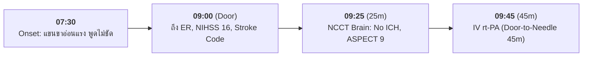

# Clinical Timeline Extraction (MedMate)

This skill reconstructs complex medical histories into a strict chronological sequence of clinical events, crucial for managing time-critical emergencies (e.g., Stroke rt-PA window, STEMI Door-to-Balloon, Sepsis Hour-1 bundle).

---

## 1. Timeline Detection Scope

Identify and extract:
- **Onset of Symptoms**: Time elapsed from symptom appearance to arrival (e.g., "เจ็บหน้าอก 2 ชม. ก่อนมา", "Last known normal at 06:00").
- **Triage & Arrival Events**: ER door time, vital signs at admission.
- **Diagnostic Interventions**: Time of initial EKG, CT Brain scan, ABG sampling, troponin results.
- **Therapeutic Actions**: Intubation, thrombolytic bolus, PCI wire crossing, IV fluid resuscitation, antibiotic administration.
- **Clinical Deterioration / Response**: Changes in Glasgow Coma Scale (GCS), drop in blood pressure, relief of symptoms.

---

## 2. Chronological Ordering Rules

1. **Relative & Absolute Anchors**: Map relative times (e.g., "1 hour after admission") relative to primary time anchors.
2. **Explicit Sequence**: If exact time is unknown, order by clinical sequence and mark `"time": "unknown / prior to admission"`.
3. **Preserve Medical Accuracy**: Do not alter event descriptions or invent timestamps.

---

## 3. Output Formats (Markdown Table & Mermaid Diagram vs. JSON)

### 3.1 Presentation Mode (Default for User Responses): Markdown Table
เมื่อตอบหรือสรุปข้อมูลลำดับเวลาแก่ผู้ใช้ บุคลากรทางการแพทย์ หรือนักศึกษาแพทย์ ให้แสดงผลในรูปแบบ **ตาราง Markdown (Table)** เสมอ:

| เวลา / ระยะเวลา (Time) | เหตุการณ์และอาการทางคลินิก (Event / Clinical Status) | หมวดหมู่ (Category) |
| :--- | :--- | :--- |
| **07:30** (Last known normal) | พบอาการแขนขาซีกขวาอ่อนแรงกะทันหัน พูดไม่เป็นภาษา | Symptom Onset |
| **09:00** (Door time) | ถึงห้องฉุกเฉิน วัดความดัน 175/95 mmHg, NIHSS 16 เปิด Stroke Fast Track | ER Admission |
| **09:25** (25 min post-door) | ตรวจ NCCT Brain: ASPECT score 9, ไม่พบภาวะเลือดออกในสมอง (No ICH) | Diagnostic Workup |
| **09:45** (45 min post-door) | ให้ยาละลายลิ่มเลือด IV rt-PA (Alteplase) ภายในหน้าต่าง 4.5 ชม. | Treatment Intervention |

### 3.2 Visual Progression Mode: Mermaid Diagram
หากต้องการนำเสนอเป็นผังเวลาเชิงภาพ ให้ใช้ **Mermaid Diagram (````mermaid ... ````)** เสมอ โดยปฏิบัติตามกฎ Unicode Safety (Node ID เป็น ASCII, ข้อความครอบ `["..."]`):



> ⚠️ **Strict Ban on ASCII Timelines:** ห้ามวาดเส้นเวลาด้วยข้อความ ASCII หรือผังต้นไม้แบบข้อความ (เช่น ❌ ห้ามใช้ `[07:30] ---> [09:00]`, `├──`, `└──`, หรือกล่องข้อความ ASCII) โดยเด็ดขาด ทั้งในคำตอบและการบันทึกไฟล์

### 3.3 Programmatic / JSON Schema Mode (สำหรับระบบ API หรือการประเมินผล Evaluator)
หากผู้ใช้ระบุเจาะจงว่าต้องการ raw JSON ให้จัดรูปแบบตามสคีมา:

```json
{
  "case_id": "DIS-2026-0093",
  "last_known_normal": "07:30",
  "door_time": "09:00 (Onset-to-Door: 90 minutes)",
  "timeline": [
    {
      "time": "07:30",
      "event": "Last known normal. Patient suddenly developed right-sided hemiplegia and global aphasia.",
      "category": "symptom_onset"
    },
    {
      "time": "09:00 (Door)",
      "event": "Arrival at ER. BP 175/95 mmHg, NIHSS score 16. Stroke Code activated.",
      "category": "admission"
    },
    {
      "time": "09:25",
      "event": "Emergency Non-contrast CT Brain completed: ASPECT score 9, no intracranial hemorrhage.",
      "category": "diagnostic"
    },
    {
      "time": "09:45",
      "event": "IV rt-PA (Alteplase) administered within 4.5-hour therapeutic window (Door-to-Needle: 45 min).",
      "category": "treatment"
    }
  ]
}
```
