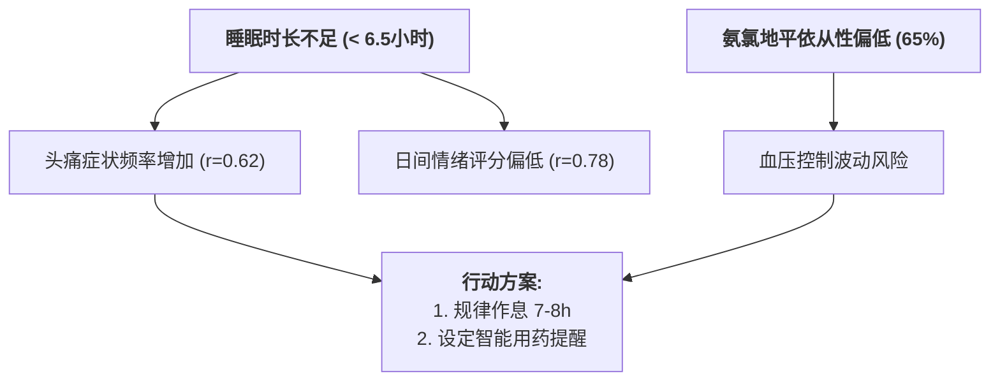

# 健康趋势分析器

分析一段时间内健康数据的趋势和模式，识别变化、相关性，并提供数据驱动的健康洞察。

## When to Use
- 需要分析一段时间内健康数据的趋势、相关性或显著变化时使用。
- 任务涉及体重、症状、用药、化验、情绪或睡眠等多维度随时间变化。
- 用户询问“最近健康状况有什么变化”或需要趋势报告时使用。

## 核心功能

### 1. 多维度趋势分析
- **体重/BMI 趋势**：追踪体重和BMI随时间的变化，评估健康趋势
- **症状模式**：识别反复出现的症状、频率变化、潜在诱因
- **药物依从性**：分析用药规律，识别漏服模式和改善空间
- **化验结果趋势**：追踪生化指标变化（胆固醇、血糖、血压等）
- **情绪与睡眠**：关联情绪状态与睡眠质量，识别心理健康趋势

### 2. 相关性分析引擎
- **药物-症状相关性**：识别新药物是否与症状变化相关
- **生活方式影响**：关联饮食/睡眠与症状和情绪
- **治疗效果评估**：衡量治疗是否导致改善
- **周期-症状相关性**：女性健康追踪中的周期相关性

### 3. 变化检测
- **显著变化**：警告快速体重变化、新症状、药物变化
- **恶化模式**：早期识别健康状况下降
- **改善识别**：强调积极的健康变化
- **阈值警报**：接近危险水平时警告（辐射、BMI极值）

### 4. 预测性洞察
- **风险评估**：基于趋势识别风险因素
- **预防建议**：基于模式建议预防措施
- **早期预警**：在问题变得严重之前预测

## 使用说明

### 触发条件

当用户提到以下场景时，使用此技能：

**通用询问**：
- ✅ "过去一段时间我的健康有什么变化？"
- ✅ "分析我的健康趋势"
- ✅ "我的身体状况有什么变化？"
- ✅ "健康状况总结"

**具体维度**：
- ✅ "我的体重/BMI有什么趋势？"
- ✅ "分析我的症状模式"
- ✅ "我的用药依从性怎么样？"
- ✅ "我的化验指标有什么变化？"
- ✅ "我的情绪和睡眠趋势"

**相关性分析**：
- ✅ "我的症状和什么相关？"
- ✅ "我的药物有效吗？"
- ✅ "睡眠和我的情绪有什么关系？"

**时间范围**：
- 默认分析**过去3个月**的数据
- 支持："过去1个月"、"过去6个月"、"过去1年"
- 支持："2025年1月至今"、"最近90天"

### 执行步骤

#### 步骤 1：确定分析时间范围

从用户输入中提取时间范围，或使用默认值（3个月）。

#### 步骤 2：读取健康数据

读取以下数据源：

```javascript
// 1. 个人档案（BMI、体重）
const profile = readFile('data/profile.json');

// 2. 症状记录
const symptomFiles = glob('data/symptoms/**/*.json');
const symptoms = readAllJson(symptomFiles);

// 3. 情绪记录
const moodFiles = glob('data/mood/**/*.json');
const moods = readAllJson(moodFiles);

// 4. 饮食记录
const dietFiles = glob('data/diet/**/*.json');
const diets = readAllJson(dietFiles);

// 5. 用药日志
const medicationLogs = glob('data/medication-logs/**/*.json');

// 6. 女性健康数据（如适用）
const cycleData = readFile('data/cycle-tracker.json');
const pregnancyData = readFile('data/pregnancy-tracker.json');
const menopauseData = readFile('data/menopause-tracker.json');

// 7. 过敏史
const allergies = readFile('data/allergies.json');

// 8. 辐射记录
const radiation = readFile('data/radiation-records.json');
```

#### 步骤 3：数据过滤

根据时间范围过滤数据：

```javascript
function filterByDate(data, startDate, endDate) {
  return data.filter(item => {
    const itemDate = new Date(item.date || item.created_at);
    return itemDate >= startDate && itemDate <= endDate;
  });
}
```

#### 步骤 4：趋势分析

对每个数据维度进行趋势分析：

**4.1 体重/BMI 趋势**
- 提取历史体重数据
- 计算BMI变化
- 识别趋势方向（上升/下降/稳定）
- 评估变化幅度

**4.2 症状模式**
- 统计症状频率
- 识别高频症状
- 分析症状时间模式
- 检测症状诱因

**4.3 药物依从性**
- 计算总体依从率
- 分析各药物依从性
- 识别漏服模式
- 评估改善建议

**4.4 化验结果**
- 追踪多次报告中的生化指标
- 与参考范围对比
- 识别改善/恶化
- 标记异常指标

**4.5 情绪与睡眠**
- 关联情绪评分与睡眠时长
- 识别情绪波动模式
- 检测压力水平
- 评估心理健康趋势

#### 步骤 5：相关性分析

使用统计方法识别相关性：

```javascript
// 皮尔逊相关系数
function pearsonCorrelation(x, y) {
  // 计算相关系数
  // 返回值范围：-1（负相关）到 1（正相关）
}

// 应用场景
- 药物开始日期 vs 症状频率
- 睡眠时长 vs 情绪评分
- 体重变化 vs 饮食记录
- 运动量 vs 情绪状态
```

#### 步骤 6：变化检测

识别显著变化：

```javascript
// 变化点检测
function detectChangePoints(timeSeries) {
  // 使用统计方法检测显著变化点
  // 例如：体重突然下降、症状突然增加
}

// 阈值警报
function checkThresholds(value, thresholds) {
  // 检查是否接近或超过危险阈值
  // 例如：BMI > 30、辐射剂量 > 安全限
}
```

#### 步骤 7：生成洞察

基于分析结果生成预测性洞察：

```javascript
// 风险评估
function assessRisks(trends) {
  // 识别高风险趋势
  // 例如：快速体重下降、频繁症状
}

// 预防建议
function generateRecommendations(trends, correlations) {
  // 基于模式建议预防措施
  // 例如：改善睡眠、提高用药依从性
}

// 早期预警
function earlyWarnings(trends) {
  // 在问题变得严重之前预测
  // 例如：症状频率上升、情绪持续低落
}
```

#### 步骤 8：生成可视化报告

生成交互式HTML报告：

1. **数据汇总**：生成JSON格式的分析结果
2. **HTML模板渲染**：将数据注入HTML模板
3. **ECharts图表配置**：配置6种交互式图表
4. **保存文件**：保存为独立HTML文件

详细输出格式参见：数据源说明

## 输出格式

### 报告输出格式（Markdown Table & Mermaid 规范）

> ⚠️ **规范要求**：禁止使用 ASCII 树状图（如 `├─`, `└─`）或 ASCII 边框字符。所有趋势与化验指标必须使用 **Markdown 表格**，流程与关联分析使用 **Mermaid 图表**。

#### 1. 总体评估与指标汇总 (Markdown Table)

| 健康维度 (Metric) | 当前值 (Current) | 3个月变化 (3-Month Delta) | 趋势评估 (Trend / Status) | 临床建议 (Action / Recommendation) |
| :--- | :--- | :--- | :--- | :--- |
| **体重 / BMI** | 68.5 kg (BMI: 23.1) | -2.3 kg (-3.2%) | 📉 逐渐减重，处于健康范围 | 继续保持当前饮食与运动习惯 |
| **药物依从性** | 总体 78% (漏服 8次) | +5% | ⚠️ 需改善（氨氯地平仅 65%） | 建议设置服药提醒或分药盒 |
| **症状模式 (头痛)** | 过去3个月共 12次 | -4次 (较上期下降) | 📉 改善中，与睡眠质量相关 (r=0.62) | 规律作息，避免熬夜 |
| **胆固醇** | 210 mg/dL | -30 mg/dL (改善 ✅) | 🟢 积极改善，接近正常目标 | 3个月后门诊复查血脂四项 |
| **空腹血糖** | 5.4 mmol/L | -0.2 mmol/L | 🟢 稳定在正常范围 | 继续低升糖指数饮食 |
| **睡眠与情绪** | 睡眠 6.5h / 情绪 6.8分 | +0.5h 睡眠 | 🟢 强正相关 (r=0.78) | 增加睡眠时长至 7-8 小时 |

#### 2. 健康关联与行动路径 (Mermaid Flowchart)



#### 3. 复查与随访计划 (Markdown Table)

| 时间窗口 (Time Window) | 检查 / 随访项目 (Action Item) | 关注指标 (Target) |
| :--- | :--- | :--- |
| **1 个月后** | 评估用药依从性改善情况 | 氨氯地平依从率 > 90% |
| **3 个月后** | 门诊复查血脂四项、空腹血糖 | 胆固醇 < 200 mg/dL |

### HTML可视化报告（完整版）

生成包含ECharts交互式图表的独立HTML文件，包含：

1. **总体评估卡片**：关键指标一目了然
2. **体重/BMI趋势图**：双Y轴折线图（体重 + BMI）
3. **症状频率图**：颜色编码的柱状图（高频红/中频黄/低频绿）
4. **药物依从性仪表盘**：总体依从率 + 各药物详情
5. **化验结果趋势图**：多系列折线图 + 参考线
6. **相关性热图**：热力图展示变量间相关性
7. **情绪与睡眠面积图**：双Y轴面积图

**HTML文件特点**：
- ✅ 完全独立（所有依赖通过CDN）
- ✅ 交互式图表（缩放、导出、图例切换）
- ✅ 响应式设计（移动端适配）
- ✅ 可打印（打印优化样式）
- ✅ 可分享（发送给医生）

## 数据源

### 主要数据源

| 数据源 | 文件路径 | 数据内容 |
|--------|---------|---------|
| 个人档案 | `data/profile.json` | 体重、身高、BMI历史 |
| 症状记录 | `data/symptoms/**/*.json` | 症状名称、严重程度、持续时间 |
| 情绪记录 | `data/mood/**/*.json` | 情绪评分、睡眠质量、压力水平 |
| 饮食记录 | `data/diet/**/*.json` | 餐次、食物、卡路里、营养素 |
| 用药日志 | `data/medication-logs/**/*.json` | 用药时间、依从性记录 |
| 化验结果 | `data/medical_records/**/*.json` | 生化指标、参考范围 |

### 辅助数据源

| 数据源 | 文件路径 | 数据内容 |
|--------|---------|---------|
| 女性周期 | `data/cycle-tracker.json` | 周期长度、症状记录 |
| 孕期追踪 | `data/pregnancy-tracker.json` | 孕周、体重、检查记录 |
| 更年期 | `data/menopause-tracker.json` | 症状、HRT使用 |
| 过敏史 | `data/allergies.json` | 过敏原、严重程度 |
| 辐射记录 | `data/radiation-records.json` | 累积辐射剂量 |

详细数据结构说明请参考：data-sources.md

## 分析算法

### 时间序列分析
- 趋势检测（线性回归）
- 季节性分析
- 异常值检测

### 相关性分析
- 皮尔逊相关系数（连续变量）
- 斯皮尔曼相关系数（有序变量）
- 交叉相关分析（时间序列）

### 变化点检测
- CUSUM算法
- 滑动窗口t检验
- 贝叶斯变化点检测

### 统计指标
- 均值、中位数、标准差
- 百分位数（25%, 50%, 75%）
- 变化率（环比、同比）

详细算法说明请参考：algorithms.md

## 安全与隐私

### 必须遵循

- ❌ 不给出医疗诊断
- ❌ 不给出具体用药建议
- ❌ 不判断生死预后
- ❌ 标注免责声明（仅供参考）

### 信息准确度

- ✅ 仅基于已记录的数据进行分析
- ✅ 不推测或推断缺失信息
- ✅ 明确标注数据来源和时间范围
- ✅ 建议应由医疗专业人员审查

### 隐私保护

- ✅ 所有数据保持本地
- ✅ 无外部API调用
- ✅ 分析结果仅保存在本地
- ✅ HTML报告独立运行（无数据传输）

## 错误处理

### 数据缺失
- **无数据**：输出"暂无数据，建议先记录[数据类型]"
- **数据不足**：输出"数据不足（需要至少1个月数据才能进行趋势分析）"
- **数据范围窄**：使用现有数据，提示"建议延长记录时间以获得更准确的趋势"

### 分析失败
- **无法计算趋势**：输出"无法计算趋势，数据点不足"
- **相关性分析失败**：输出"相关性分析需要更多数据"
- **图表渲染失败**：降级为文本报告

## 使用示例

### 示例 1：一般健康趋势
**用户**："过去3个月我的健康有什么变化？"
**输出**：生成完整的HTML报告，包含所有维度的趋势分析

### 示例 2：症状分析
**用户**："分析我的症状模式"
**输出**：重点分析症状频率、诱因、趋势

### 示例 3：体重趋势
**用户**："我的体重有什么趋势？"
**输出**：重点分析体重/BMI变化、与饮食/运动的相关性

### 示例 4：药物有效性
**用户**："我的降压药有效吗？"
**输出**：关联药物开始日期与血压读数、症状改善

更多完整示例请参考：examples.md

## 相关命令

- `/symptom`：记录症状
- `/mood`：记录情绪
- `/diet`：记录饮食
- `/medication`：管理药物和用药记录
- `/query`：查询特定数据点

## 技术实现

### 工具限制

此Skill仅使用以下工具（无需额外权限）：
- **Read**：读取JSON数据文件
- **Grep**：搜索特定模式
- **Glob**：按模式查找数据文件
- **Write**：生成HTML报告（保存到`data/health-reports/`）

### 性能优化

- 增量读取：仅读取指定时间范围的数据文件
- 数据缓存：避免重复读取同一文件
- 延迟计算：按需生成图表数据

### 扩展性

- 支持添加新的数据维度
- 支持自定义图表类型
- 支持自定义分析算法

## Limitations
- Use this skill only when the task clearly matches the scope described above.
- Do not treat the output as a substitute for environment-specific validation, testing, or expert review.
- Stop and ask for clarification if required inputs, permissions, safety boundaries, or success criteria are missing.
