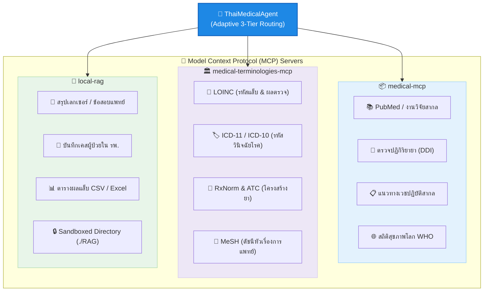

# 🩺 Thai Medical Harness System (Antigravity & MCP Workbench)

ระบบ **Harness Agent ทางการแพทย์อัจฉริยะ** ที่พัฒนาขึ้นบนเฟรมเวิร์ก **Google Antigravity (AGY)** ขับเคลื่อนด้วยโปรโตคอล **Model Context Protocol (MCP)** มุ่งเน้นการสื่อสารด้วยภาษาไทยเป็นหลัก (**Thai-Language First**)

ระบบนี้ได้รับการออกแบบสถาปัตยกรรมให้มี **Adaptive 3-Tier Routing** คัดกรองระดับความลึกของเนื้อหาและคำศัพท์แพทย์ให้เหมาะสมและปลอดภัยต่อผู้ใช้งาน 3 กลุ่ม ได้แก่ **แพทย์, นักศึกษาแพทย์ (นศพ.), และคนทั่วไป** พร้อมความสามารถในการดึงข้อมูลแบบลูกผสม (Hybrid RAG) ทั้งจากฐานข้อมูลวิจัยระดับโลกและไฟล์เอกสารส่วนตัวภายในเครื่อง

---

## 📑 สารบัญ (Table of Contents)

- [🏗️ โครงสร้างโฟลเดอร์ของโปรเจกต์ (Directory Structure)](#️-โครงสร้างโฟลเดอร์ของโปรเจกต์-directory-structure)
- [📦 สรุปความสามารถของ Skills ทั้ง 10 ทักษะ (Skills Summary)](#-สรุปความสามารถของ-skills-ทั้ง-10-ทักษะ-skills-summary)
- [⚙️ คุณสมบัติเด่นของระบบ (Core Features)](#️-คุณสมบัติเด่นของระบบ-core-features)
- [🛠️ ขุมพลังและการทำงานของ MCP Servers (MCP Capabilities)](#️-ขุมพลังและการทำงานของ-mcp-servers-mcp-capabilities)
  - [1. `medical-mcp` — คลังงานวิจัย เภสัชวิทยา และแนวทางเวชปฏิบัติ](#1-medical-mcp--คลังงานวิจัย-เภสัชวิทยา-และแนวทางเวชปฏิบัติ)
  - [2. `medical-terminologies-mcp` — รหัสมาตรฐานและคำศัพท์การแพทย์สากล](#2-medical-terminologies-mcp--รหัสมาตรฐานและคำศัพท์การแพทย์สากล)
  - [3. `local-rag` — คลังเอกสารและความรู้ส่วนตัว](#3-local-rag--คลังเอกสารและความรู้ส่วนตัว)
- [💻 วิธีการติดตั้งและใช้งานบน Antigravity CLI (ผ่าน Terminal)](#-วิธีการติดตั้งและใช้งานบน-antigravity-cli-ผ่าน-terminal)
  - [1. สิ่งที่ต้องเตรียมในเครื่องคอมพิวเตอร์ (Prerequisites)](#1-สิ่งที่ต้องเตรียมในเครื่องคอมพิวเตอร์-prerequisites)
  - [2. การเปิดใช้งานและสิทธิ์เข้าถึง (Authentication)](#2-การเปิดใช้งานและสิทธิ์เข้าถึง-authentication)
  - [3. การเตรียมคลังข้อมูลส่วนตัว (Local RAG Setup)](#3-การเตรียมคลังข้อมูลส่วนตัว-local-rag-setup)
- [🖥️ วิธีการติดตั้งและใช้งานบน Antigravity Desktop (แอปหน้าต่าง GUI)](#️-วิธีการติดตั้งและใช้งานบน-antigravity-desktop-แอปหน้าต่าง-gui)
  - [ขั้นตอนที่ 1: การเปิด Workspace บนตัวแอป](#ขั้นตอนที่-1-การเปิด-workspace-บนตัวแอป)
  - [ขั้นตอนที่ 2: การล็อกอินเพื่อยืนยันสิทธิ์ (Account Authentication)](#ขั้นตอนที่-2-การล็อกอินเพื่อยืนยันสิทธิ์-account-authentication)
  - [ขั้นตอนที่ 3: เปิดสิทธิ์การรัน Medical MCP และ Local RAG](#ขั้นตอนที่-3-เปิดสิทธิ์การรัน-medical-mcp-และ-local-rag)
  - [ขั้นตอนที่ 4: เริ่มต้นแชตใช้งาน](#ขั้นตอนที่-4-เริ่มต้นแชตใช้งาน)
- [🧪 การรัน Benchmark และ Evaluation Harness](#-การรัน-benchmark-และ-evaluation-harness)
- [💡 ตัวอย่างสถานการณ์และการสั่งใช้งานจริง (Production Use Cases)](#-ตัวอย่างสถานการณ์และการสั่งใช้งานจริง-production-use-cases)
- [🔐 นโยบายความปลอดภัยของข้อมูล (Data Isolation & Privacy)](#-นโยบายความปลอดภัยของข้อมูล-data-isolation--privacy)

---

## 🏗️ โครงสร้างโฟลเดอร์ของโปรเจกต์ (Directory Structure)

```text
MedMate/
├── AGENTS.md                   # 🧠 กฎและบทบาทระดับ Root Workspace
├── README.md                   # 📄 คู่มือการใช้งานระบบฉบับละเอียด (ไฟล์นี้)
├── Usage_exam.md               # 📋 ตัวอย่างโจทย์คำถามและการทดสอบตาม Tier
├── RAG/                        # 📂 คลังเอกสารส่วนตัวผู้ใช้ (10 เคสศึกษาจำลองคลินิก)
│   ├── case_study_01.txt       # เคส 01: DKA + Prerenal AKI + Anion Gap 23
│   ├── case_study_02.txt       # เคส 02: Inferior STEMI + RV Infarction + Shock
│   ├── case_study_03.txt       # เคส 03: Acute Ischemic Stroke + rt-PA Window
│   ├── case_study_04.txt       # เคส 04: Severe CAP + Sepsis (CURB-65 = 4)
│   ├── case_study_05.txt       # เคส 05: Cirrhosis + Variceal Bleeding + Encephalopathy
│   ├── case_study_06.txt       # เคส 06: Severe Asthma + Impending Respiratory Arrest
│   ├── case_study_07.txt       # เคส 07: Acute Biliary Pancreatitis + SIRS (BISAP = 3)
│   ├── case_study_08.txt       # เคส 08: Severe Anaphylactic Shock + IM Epinephrine
│   ├── case_study_09.txt       # เคส 09: Hypertensive Emergency + Flash Pulmonary Edema
│   └── case_study_10.txt       # เคส 10: Severe Hyponatremia (SIADH) + ODS Prevention
├── medical_skill/              # ⚡ โมดูลคำนวณคลินิกและระบบแคช Medical MCP Cache Layer
│   ├── medical_mcp_cache.py    # Dual-Layer Cache, zlib Level 6, Anti-Hallucination Oracle
│   ├── clinical_normalizer.py  # Database-Driven Clinical Normalizer (SQLite + In-Memory Matcher)
│   ├── mcp_router.py           # Transparent MCP Router Interceptor
│   ├── clinical_verifier.py    # Citation Verifier, Grounding Oracle & Red Flag Gatekeeper
│   ├── data/
│   │   └── clinical_lexicon.db # 🗄️ Master Clinical Lexicon (420+ คำศัพท์, prevent_merge ป้องกันการยุบผิด)
│   └── scripts/
│       └── seed_clinical_lexicon.py # Automated Seeder & Case Study Harvester
├── cache/                      # 🗄️ ฐานข้อมูล SQLite ของระบบแคชชั่วคราว (medical_mcp_cache.db)
├── output/                     # 📤 โฟลเดอร์ส่งออกรายงานทางคลินิกและไฟล์สเปก
├── evals/                      # 🧪 ระบบ Evaluation Harness วัดผลความแม่นยำทางการแพทย์
│   ├── eval_case_study.py      # สคริปต์ตรวจให้คะแนนและเปรียบเทียบกับ Ground Truth (10 เคส)
│   ├── test_medical_cache.py   # ชุดทดสอบระบบแคช (8 ด้านสำคัญ: Latency, zlib, Oracle)
│   ├── test_clinical_normalizer.py # ชุดทดสอบ Normalizer (8 ด้าน: คำศัพท์ไทย, ชื่อการค้า, prevent_merge)
│   └── run_cache_benchmark.py  # เอนจินรันเบนช์มาร์ก 4 เฟสครบวงจร
└── .agents/                    # ⚙️ โฟลเดอร์ควบคุมระบบหลักของ Antigravity
    ├── AGENTS.md               # กฎระเบียบและบทบาทของ Agent (Mirror)
    ├── mcp_config.json         # พูลลงทะเบียนเชื่อมต่อ MCP Servers
    └── skills/                 # คลังทักษะทางการแพทย์และ Harness ครบวงจร (19 ทักษะ)
        ├── medical_skill/              # [Core] คำนวณ ABG, Anion Gap, DKA, AKI KDIGO & MCP Cache
        ├── clinical-data-structuring/  # [New] แปลงเวชระเบียนเป็น Structured JSON Schema
        ├── clinical-entity-extraction/ # [New] สกัด Named Entities (Diseases, Meds, Labs)
        ├── clinical-coding-icd/        # [New] จับคู่รหัสโรคมาตรฐานสากล ICD-10/11
        ├── clinical-timeline-extraction/# [New] สกัดเส้นเวลาและเหตุการณ์สำคัญทางคลินิก
        ├── clinical-risk-prediction/   # [New] ประเมินความเสี่ยงและจัดระดับความรุนแรง (CURB-65, Killip)
        ├── clinical-diagnostic-support/# [New] สนับสนุนการวินิจฉัยแยกโรค Differential Diagnoses
        ├── clinical-qa/                # [New] ถาม-ตอบจากเวชระเบียนแบบ Grounded ป้องกัน Hallucination
        ├── clinical-report-generation/ # [New] สร้างรายงานเวชระเบียนและสรุปประวัติส่งออก ./output/
        ├── pubmed-database/            # ค้นหางานวิจัยสากลด้วย MeSH & PICO Framework
        ├── claude-ally-health/         # ระบบซักประวัติ HPI, Triage และ Red Flag Detector
        ├── health-trend-analyzer/      # วิเคราะห์แนวโน้มผลแล็บและสัญญาณชีพต่อเนื่อง
        ├── scientific-writing/         # เรียบเรียงเคสคลินิกและสร้าง SOAP Note
        ├── rag-engineer/               # จัดการคลังเอกสาร RAG และตารางผลแล็บ
        ├── tool-use-guardian/          # ดักจับและกู้คืนความผิดพลาดของ MCP Tools
        ├── gdpr-data-handling/         # การรักษาความลับคนไข้ (De-identification: Indexed Tags)
        ├── agent-evaluation/           # Benchmark และประเมินคุณภาพคำตอบ
        ├── config_manager_skill/       # ตรวจสอบความพร้อมและ Health Check ระบบ
        └── windows-node-setup/         # คู่มือติดตั้ง Node.js & nvm ผ่าน winget บน Windows
```

---

## 📦 สรุปความสามารถของ Skills ทั้ง 19 ทักษะ (Skills Summary)

| Skill Name | สรุปความสามารถแบบย่อ (Core Superpower) | กลุ่มผู้ใช้หลัก |
| :--- | :--- | :---: |
| 🧪 **`medical_skill`** | คำนวณค่าคลินิก (Acid-Base, Anion Gap, DKA Criteria, KDIGO AKI) และ Route คำสั่งไปยัง MCP Servers | ทุก Tier |
| 📋 **`clinical-data-structuring`** | แปลงประวัติคนไข้และโน้ตคลินิกแบบ Unstructured ให้อยู่ในรูป JSON Schema มาตรฐาน | ทุก Tier / Harness |
| 🏷️ **`clinical-entity-extraction`** | สกัด Named Entities (Diseases, Symptoms, Meds, Procedures, Labs) คงรูปข้อความเดิม | ทุก Tier |
| 🏛️ **`clinical-coding-icd`** | ถอดรหัสและจับคู่รหัสโรคมาตรฐานสากล ICD-10/11 ป้องกันการสร้างรหัสเท็จ | แพทย์ / นศพ. |
| ⏱️ **`clinical-timeline-extraction`** | สกัดลำดับเหตุการณ์การรักษาและ Onset-to-Door Time จัดเรียงเป็น Chronological Timeline | แพทย์ / นศพ. |
| ⚠️ **`clinical-risk-prediction`** | ประเมินระดับความเสี่ยง (Low/Mod/High/Critical) และคำนวณคะแนน CURB-65, BISAP, Killip | ทุก Tier |
| 🩺 **`clinical-diagnostic-support`** | เสนอและจัดอันดับการวินิจฉัยแยกโรค (Differential Diagnoses) พร้อมระบุระดับความไม่แน่นอน | แพทย์ / นศพ. |
| 🔍 **`clinical-qa`** | ตอบคำถามจากประวัติคนไข้และ RAG แบบ Grounded 100% พร้อม Fallback ชัดเจนเมื่อไม่มีข้อมูล | ทุก Tier |
| 📄 **`clinical-report-generation`** | จัดทำรายงานเวชระเบียน, บันทึกการส่งต่อ, และ Discharge Summary บันทึกลงใน `./output/` | แพทย์ / นศพ. |
| 📚 **`pubmed-database`** | ค้นหางานวิจัยระดับโลกด้วย MeSH Terms, PICO Syntax, กรองเฉพาะ RCTs / Meta-Analysis พร้อมดึง PMID/DOI | แพทย์ / นศพ. |
| 🩺 **`claude-ally-health`** | ซักประวัติอาการ (HPI), คัดกรอง Triage, วินิจฉัยแยกโรค และตรวจจับสัญญาณอันตราย (**Red Flags**) | ทุก Tier |
| 📊 **`health-trend-analyzer`** | วิเคราะห์แนวโน้มผลแล็บและสัญญาณชีพต่อเนื่องตามช่วงเวลา (Longitudinal Trends) เช่น ค่าไต ค่าน้ำตาล | แพทย์ / คนไข้ |
| 📝 **`scientific-writing`** | เรียบเรียงต้นฉบับงานวิจัยวิชาการโครงสร้าง IMRAD และการสังเคราะห์หลักฐานวิชาการ | นศพ. / แพทย์ |
| 📂 **`rag-engineer`** | จัดการโครงสร้างเอกสารใน `RAG/` แบ่ง Chunking และดึงข้อมูลตารางผลแล็บ/เลกเชอร์ได้แม่นยำ | ทุก Tier |
| 🛡️ **`tool-use-guardian`** | ดักจับและกู้คืนข้อผิดพลาดเมื่อเรียกใช้ MCP Tools (Auto-Retry, จัดการ Timeout และแก้ Schema ผิดรูป) | ระบบ Harness |
| 🔒 **`gdpr-data-handling`** | เซนเซอร์และลบข้อมูลระบุตัวตนคนไข้ (De-identification: `[PATIENT_1]`, `[DATE_1]`) ตามมาตรฐาน PDPA/HIPAA | ทุก Tier |
| 🎯 **`agent-evaluation`** | รันชุด Benchmark ทดสอบและให้คะแนนความแม่นยำของการวินิจฉัยเคสเทียบกับ Ground Truth | ผู้พัฒนาระบบ |
| ⚙️ **`config_manager_skill`** | ตรวจสอบความพร้อม (Health Check) ของสภาพแวดล้อม Node.js, NPX, Python และ MCP Config | ผู้ดูแลระบบ |
| 🪟 **`windows-node-setup`** | คู่มือการติดตั้งสภาพแวดล้อม Node.js, NPX และ NVM บน Windows ผ่าน winget | Windows Users |

---

## ⚙️ คุณสมบัติเด่นของระบบ (Core Features)

1. **Thai-Language First (Clinical Translation):** 
   ระบบรับอินพุตและเอาต์พุตเป็นภาษาไทยเป็นหลัก ทว่าในลูปความคิด (Thought Process) ตัว Agent จะทำการแปลคำหลักเป็นศัพท์แพทย์สากล (ภาษาอังกฤษ) เพื่อไปคิวรีข้อมูลที่ถูกต้องจากฐานข้อมูลต่างประเทศ ก่อนเรียบเรียงสรุปกลับมาเป็นภาษาไทยเพื่อป้องกันความบิดเบือนของข้อมูล
2. **Adaptive 3-Tier Routing:** 
   วิเคราะห์บริบทผู้ใช้งานอัตโนมัติ เพื่อสลับบทบาทสไตล์การให้คำปรึกษา:
   *   **Tier 1: แพทย์ (Doctor Mode)** -> สื่อสารกระชับ ทับศัพท์ภาษาอังกฤษระดับคลินิก เน้นสถิติวารสาร งานวิจัยทดลอง และระดับหลักฐาน (Level of Evidence)
   *   **Tier 2: นักศึกษาแพทย์ (Student Mode)** -> สไตล์อาจารย์แพทย์ผู้ให้คำแนะนำ เน้นพยาธิสภาพ (Pathophysiology), กลไกการเกิดโรค, และสรุปประวัติในรูปแบบโครงสร้างแพทย์ (เช่น SOAP Note)
   *   **Tier 3: คนทั่วไป (Patient Mode)** -> ใช้ภาษาชาวบ้าน อ่อนโยน เข้าอกเข้าใจ ห้ามใช้คำย่อภาษาอังกฤษที่เข้าใจยาก เน้นแนวทางดูแลตนเองเบื้องต้น
3. **Medical Emergency & Red Flag Interceptor:**
   หากตรวจพบอาการวิกฤต เช่น เจ็บแน่นหน้าอกร้าว, สโตรก (FAST), DKA ช็อก หรือแพ้ยารุนแรง ระบบจะขึ้นเตือนให้โทร **1669** หรือไปห้องฉุกเฉินทันที
4. **Hybrid RAG Capability:**
   ค้นหาความรู้แบบสองประสาน โดยค้นคว้าสดจากวารสารการแพทย์ทั่วโลก (PubMed API) ควบคู่กับการสแกนหาข้อสอบ เอกสารสไลด์เรียน หรือประวัติคนไข้ในโรงพยาบาลของคุณที่เก็บไว้ในโฟลเดอร์ `RAG/`
5. **Lab Interpretation Tool:**
   รองรับระบบดึงค่ามาตรฐานสากล (LOINC Reference Ranges) ช่วยจำแนกผลแล็บเบื้องต้น เช่น ผลเลือด ค่าตับ ค่าไต พร้อมแสดงแนวทางการวินิจฉัยแยกโรค (Differential Diagnosis) สำหรับสายวิชาการ
6. **Proactive Evidence-on-Demand (PubMed Inquiry):**
   สำหรับผู้ใช้ระดับแพทย์ (Tier 1) และ นศพ. (Tier 2) ระบบจะสรุปแนวทางทางคลินิกอย่างกระชับก่อน แล้วเสนอทางเลือกถามผู้ใช้ว่าต้องการให้สืบค้นงานวิจัย RCTs / Systematic Reviews ฉบับเต็มจาก PubMed เพิ่มเติมหรือไม่ เพื่อให้ควบคุมความลึกของข้อมูลได้ตามสะดวก
7. **Mandatory Legal Disclaimer:**
   มีกลไกตรวจสอบความปลอดภัยทางกฎหมาย (Safe-Guard Footer) หากตรวจพบว่าผู้ใช้งานเป็นคนทั่วไป ระบบจะบังคับพิมพ์ข้อความคำเตือนปฏิเสธความรับผิดชอบทางการแพทย์ภาษาไทยไว้ที่ท้ายคำตอบเสมออย่างเคร่งครัด

---

## 🛠️ ขุมพลังและการทำงานของ MCP Servers (MCP Capabilities)

ระบบ MedMate เชื่อมต่อกับขุมพลัง **Model Context Protocol (MCP)** รวม 3 เซิร์ฟเวอร์หลัก เพื่อเสริมความแม่นยำทางการแพทย์แบบครบวงจร:



### 1. `medical-mcp` — คลังงานวิจัย เภสัชวิทยา และแนวทางเวชปฏิบัติ
* **สืบค้นวารสารและงานวิจัยระดับโลก (`search-medical-literature`, `get-article-details`, `search-medical-journals`, `search-google-scholar`):** ดึงบทความวิชาการ การทดลองทางคลินิก (RCTs), Meta-Analyses และบทคัดย่อฉบับเต็มสดจาก **PubMed** พร้อม PMID และ URL
* **เภสัชวิทยาและฐานข้อมูลยา FDA (`search-drugs`, `get-drug-details`, `search-drug-nomenclature`):** ค้นหาข้อมูลยาที่ขึ้นทะเบียนกับ US FDA, NDC, ข้อบ่งชี้, ข้อห้ามใช้ และ Black Box Warnings
* **ตรวจสอบปฏิกิริยาระหว่างยา (`check-drug-interactions`):** วิเคราะห์ความเสี่ยงของอันตรกิริยาระหว่างยา (Drug-Drug Interactions: DDI) พร้อมระดับความรุนแรงและแนวทางการจัดการ
* **แนวทางเวชปฏิบัติสากล (`search-clinical-guidelines`):** ค้นหาเกณฑ์และแนวทางการรักษาโรคที่ได้มาตรฐานตามหมวดหมู่การแพทย์และระดับหลักฐาน (Level of Evidence)
* **สถิติสุขภาพโลก (`get-health-statistics`):** ดึงข้อมูลตัวชี้วัดด้านสาธารณสุขและระบาดวิทยาจาก WHO Global Health Observatory


### 2. `medical-terminologies-mcp` — รหัสมาตรฐานและคำศัพท์การแพทย์สากล
* **แปลผลและค้นหารหัสแล็บ (LOINC):** ค้นหารหัสมาตรฐานการตรวจทางห้องปฏิบัติการและค่าการวัดทางคลินิก เช่น ค่าน้ำตาล (Glucose), ค่าไต (Creatinine), ค่าตับ, เกลือแร่
* **รหัสจำแนกโรคสากล (ICD-11 & ICD-10):** ค้นหารหัสวินิจฉัยโรคตามมาตรฐานองค์การอนามัยโลก (WHO) พร้อมระบบจับคู่รหัสข้ามเวอร์ชัน
* **ข้อมูลและโครงสร้างยา (RxNorm & ATC):** ค้นหารหัสยา ส่วนประกอบสำคัญ และการจัดกลุ่มยาตามระบบบำบัดทางกายวิภาคและเคมี
* **ดัชนีหัวเรื่องทางการแพทย์ (MeSH):** เชื่อมโยงคำค้นทางการแพทย์เข้ากับดัชนีมาตรฐานสากล
* **ค้นหาเปรียบเทียบข้ามระบบ (Cross-Terminology):** เทียบเคียง Concept เดียวกันข้ามระบบรหัสมาตรฐานต่างๆ

### 3. `local-rag` — คลังเอกสารและความรู้ส่วนตัว
* **สืบค้นไฟล์เอกสารส่วนตัว:** อ่านและวิเคราะห์ไฟล์สรุปวิชาเรียน, สไลด์บรรยาย, แนวข้อสอบ, บันทึกประวัติผู้ป่วย หรือตารางข้อมูลที่วางไว้ในโฟลเดอร์ `./RAG`
* **ความปลอดภัยระดับสูงสุด (Sandboxed):** โมเดล AI จะเข้าถึงได้เฉพาะไฟล์ภายในโฟลเดอร์ `RAG` เท่านั้น เพื่อปกป้องข้อมูลสำคัญของผู้ใช้

### 4. `medical-mcp-cache` — ระบบแคชความเร็วสูงและประหยัด AI Token (Tier-0 Middleware)
* **Dual-Layer Caching:** L1 In-Memory LRU (`<0.2ms`) + L2 SQLite Compressed Disk Cache (`<2.0ms`)
* **High-Density zlib Compression:** บีบอัดระดับ BLOB ด้วย `zlib` (Level 6) ประหยัดพื้นที่ 65% – 75% ทำให้ขนาดเริ่มต้น 100 MB เก็บข้อมูลเทียบเท่า 350 – 400 MB
* **Zero Medical Information Loss:** การันตีความครบถ้วนของข้อมูลคลินิก (ผลแล็บ, หน่วยวัด, โดสยา, DDI, PMIDs) พร้อมตัดขยะ Metadata ประหยัด Input Token ของ AI ได้ 50% – 70%
* **Anti-Hallucination Grounding Oracle:** ดัชนีหมายเลข PMID และรหัสโรค/แล็บแท้จริง ป้องกัน AI ปลอมเลขอ้างอิงตามกฎข้อ 2.5 ของ `AGENTS.md`
* **คำสั่งบริหารจัดการผ่าน CLI:**
  ```bash
  # ตรวจสอบสถานะสุขภาพและการประหยัด Token
  python3 -m medical_skill.medical_mcp_cache --stats
  
  # ตรวจสอบรายการ PMIDs ใน Grounding Oracle
  python3 -m medical_skill.medical_mcp_cache --pmids
  
  # ล้างแคชเฉพาะหมวดหมู่ (literature, drug, terminology, guideline, local_rag)
  python3 -m medical_skill.medical_mcp_cache --purge-tag drug
  ```

---

## 💻 วิธีการติดตั้งและใช้งานบน Antigravity CLI (ผ่าน Terminal)

หากคุณเน้นการทำงานสายโปรแกรมเมอร์ที่ทำงานผ่าน Terminal อย่างรวดเร็ว สามารถใช้งานได้ดังนี้:

### 1. สิ่งที่ต้องเตรียมในเครื่องคอมพิวเตอร์ (Prerequisites)
* ติดตั้ง **AGY CLI (Antigravity Framework)** เรียบร้อยแล้ว
* ติดตั้ง **Node.js (เวอร์ชัน 18 ขึ้นไป)** เพื่อให้ระบบสามารถใช้สคริปต์คำสั่ง `npx` ในการดึงแพลตฟอร์มเซิร์ฟเวอร์ย่อยของ MCP มาทำงานได้

### 2. การเปิดใช้งานและสิทธิ์เข้าถึง (Authentication)
ระบบของ Antigravity ใช้ระบบสิทธิ์การล็อกอินผูกกับบัญชีผู้ใช้แทนการใช้ API Key แบบเก่า:
1. เปิด Terminal ในโฟลเดอร์โปรเจกต์
2. พิมพ์คำสั่งล็อกอินผ่านเว็บเบราว์เซอร์:
   ```bash
   agy login
   ```
3. กดรับสิทธิ์การใช้งานผ่านบัญชี Google Account ของคุณจนเบราว์เซอร์ขึ้นว่า "Authentication successful"

### 3. การเตรียมคลังข้อมูลส่วนตัว (Local RAG Setup)
คุณสามารถนำไฟล์เนื้อหาที่ต้องการให้ AI เข้าไปอ่านมาวางไว้ในโฟลเดอร์ `RAG/` ได้ทันที (ระบบเปิดแซนด์บ็อกซ์ล็อกความปลอดภัยไว้เฉพาะโฟลเดอร์นี้เท่านั้น) ตัวอย่างเช่น:
* วางไฟล์ `RAG/pharmacology_note.txt` (สรุปวิชากลไกยา)
* วางไฟล์ `RAG/case_study_01.txt` (บันทึกประวัติผู้ป่วยจำลอง DKA + AKI)

---

## 🖥️ วิธีการติดตั้งและใช้งานบน Antigravity Desktop (แอปหน้าต่าง GUI)

หากคุณชื่นชอบการใช้งานผ่านแอปพลิเคชันหน้าต่าง UI (**Antigravity Desktop App**) สามารถนำโฟลเดอร์นี้ไปเปิดใช้งานได้ตามขั้นตอนดังนี้:

### ขั้นตอนที่ 1: การเปิด Workspace บนตัวแอป
1. เปิดแอป **Antigravity Desktop** ขึ้นมา
2. ไปที่เมนู **File > Open Workspace** (หรือกดปุ่มลัด `Ctrl + O` / `Cmd + O`)
3. เลือกไปที่โฟลเดอร์หลักของโปรเจกต์คุณ (`MedMate`)
4. ตัวแอปจะสแกนและโหลดโฟลเดอร์ คอนฟิกเอกสาร รวมถึงอ่านไฟล์อัปเดตในไดเรกทอรี `.agents/` เข้ามาสู่ระบบอัตโนมัติ

### ขั้นตอนที่ 2: การล็อกอินเพื่อยืนยันสิทธิ์ (Account Authentication)
1. มองไปที่**มุมขวาบน**ของแอปพลิเคชัน คลิกที่ไอคอนโปรไฟล์หรือปุ่ม **Sign In**
2. เลือก **Sign in with Google** ระบบจะเปิด Browser ขึ้นมาเพื่อให้คุณเข้าสู่ระบบด้วยบัญชี Google
3. เมื่อขึ้นข้อความสำเร็จ ให้กลับมาที่ตัวแอป คุณจะสามารถใช้งานโควตาการประมวลผลโมเดลระดับสูงได้ทันทีโดยไม่ต้องกรอก API Key

### ขั้นตอนที่ 3: เปิดสิทธิ์การรัน Medical MCP และ Local RAG
เนื่องจากระบบความปลอดภัยของ Antigravity Desktop จะล็อกสิทธิ์ปลั๊กอินภายนอกไว้เป็นค่าเริ่มต้น คุณต้องไปกดอนุญาตดังนี้:
1. ไปที่เมนู **Settings (รูปเฟือง)** > เลือกแท็บ **MCP Servers**
2. คุณจะเห็นรายชื่อเซิร์ฟเวอร์แพทย์ ได้แก่ `medical-mcp`, `medical-terminologies-mcp` และ `local-rag` ปรากฏขึ้นมาในลิสต์
3. กดสวิตช์เปลี่ยนสถานะให้เป็น **Enable** หรือ **Allow/Trust** ทุกตัว เพื่ออนุญาตให้แอปสั่งรันคอมมานด์ไลน์เบื้องหลังผ่านระบบของคุณได้อย่างปลอดภัย

### ขั้นตอนที่ 4: เริ่มต้นแชตใช้งาน
1. เปิดหน้าต่าง **Chat / Agent Workbench** ภายในแอป
2. ในช่องเลือกตัวแทน (Agent Selector) ให้เลือกใช้งานโปรไฟล์ **"ThaiMedicalAgent"** (ที่ระบบดึงมาจากไฟล์ `AGENTS.md`)
3. พิมพ์ข้อความสอบถามเคสแพทย์ภาษาไทยในช่องแชตได้ทันที

---

## 🧪 การรัน Benchmark และ Evaluation Harness

MedMate มีระบบวัดผลความแม่นยำทางการแพทย์และการทดสอบสมรรถนะแคชแบบอัตโนมัติ:

```bash
# 1. รันการประเมินเคสจำลองคลินิก 10 เคส + Structured Evaluators (Ground Truth Benchmark)
python3 evals/eval_case_study.py

# 2. รันชุดทดสอบความปลอดภัยและการทำงานของ Database-Driven Normalizer
python3 evals/test_clinical_normalizer.py

# 3. รันชุดทดสอบความสมบูรณ์ของระบบแคช (Dual-Layer, zlib Level 6, Anti-Hallucination Oracle)
python3 evals/test_medical_cache.py

# 4. รันเอนจินจำลอง Benchmark แคชแบบ End-to-End ครบทั้ง 4 เฟส
python3 evals/run_cache_benchmark.py

# 5. ตรวจสอบสถานะความพร้อมของ MCP และระบบแคชผ่าน Health Check
python3 .agents/skills/config_manager_skill/scripts/check_mcp_health.py
```

---

## 💡 ตัวอย่างสถานการณ์และการสั่งใช้งานจริง (Production Use Cases)

ดูตัวอย่างคำถามและการทดสอบแบบเต็มได้ที่ไฟล์ **[Usage_exam.md](Usage_exam.md)**

1. **[Tier 1 - แพทย์]**: ปรับโดสยาผู้ป่วยโรคไต (CKD Stage 4), อัปเดต Clinical Trials มะเร็งปอด NSCLC จาก PubMed
2. **[Tier 2 - นศพ.]**: สรุป Pathophysiology DKA, ถอดประวัติคนไข้ใน `RAG/case_study_01.txt` เป็น SOAP Note
3. **[Tier 3 - คนทั่วไป]**: อธิบายอาการหน้ามืดจากความดันต่ำ (Orthostatic Hypotension) พร้อมเตือนข้อควรระวัง

---

## 🔐 นโยบายความปลอดภัยของข้อมูล (Data Isolation & Privacy)
เพื่อป้องกันไม่ให้ข้อมูลทางการแพทย์ที่สำคัญรั่วไหล ปลั๊กอิน `local-rag` ถูกออกแบบมาให้รันผ่านโปรโตคอลระบบไฟล์ที่มีการกำกับขอบเขตอย่างเข้มงวด (`@modelcontextprotocol/server-filesystem`) ตัวโมเดล AI จะได้รับอนุญาตให้สแกน อ่าน หรือเขียนไฟล์**เฉพาะภายในไดเรกทอรี `./RAG` ที่ระบุไว้ในคอนฟิกเท่านั้น** โดยไม่มีสิทธิ์เข้าถึงระบบไฟล์หลักของระบบปฏิบัติการหรือโฟลเดอร์อื่นนอกเหนือจากนี้ ทำให้มีความปลอดภัยสูงสุดระดับองค์กร
