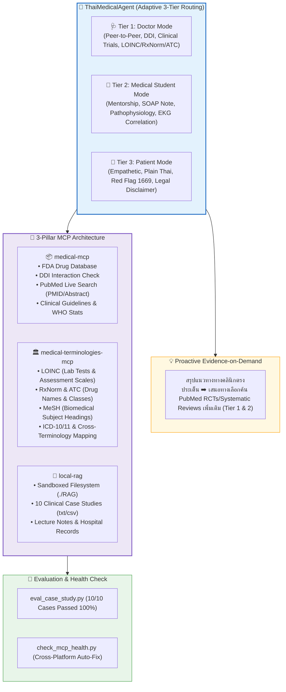

# 🩺 MedMate System Overview & Usage Guide (Usage_exam.md)

> ระบบ **Thai Medical Harness Agent** อัจฉริยะที่พัฒนาขึ้นบนเฟรมเวิร์ก **Google Antigravity (AGY)** ร่วมกับโปรโตคอล **Model Context Protocol (MCP)** มุ่งเน้นการสื่อสารด้วยภาษาไทยเป็นหลัก (**Thai-Language First**)

---

## 📑 สารบัญเอกสาร (Table of Contents)

1. [🏗️ สถาปัตยกรรมระบบ (System Architecture)](#️-สถาปัตยกรรมระบบ-system-architecture)
2. [🎯 คุณสมบัติเด่นของระบบ (Core Capabilities)](#-คุณสมบัติเด่นของระบบ-core-capabilities)
   - [Adaptive 3-Tier Routing](#1--การปรับระดับภาษาและบทบาทอัตโนมัติ-adaptive-3-tier-routing)
   - [Proactive Evidence-on-Demand](#2--ระบบสืบค้นงานวิจัยเชิงรุกตามความสมัครใจ-proactive-evidence-on-demand)
   - [3-Pillar MCP Architecture](#3--ขุมพลัง-3-เสาหลักของ-model-context-protocol-mcp)
3. [🗂️ สารบัญเคสศึกษาจำลอง 10 โรคในคลังความรู้ (RAG Case Studies)](#️-สารบัญเคสศึกษาจำลองในคลังความรู้-rag)
4. [📋 ตัวอย่างข้อความคำถามทดสอบจริง (Usage & Examination Prompts)](#-ตัวอย่างข้อความคำถามทดสอบจริง-usage--examination-prompts)
   - [Tier 2: สำหรับนักศึกษาแพทย์ (Medical Student Mode)](#-1-ตัวอย่างสำหรับ-นักศึกษาแพทย์-นศพ-tier-2---medical-student-mode)
   - [Tier 1: สำหรับแพทย์ / บุคลากรคลินิก (Doctor Mode)](#-2-ตัวอย่างสำหรับ-แพทย์--บุคลากรคลินิก-tier-1---doctor-mode)
   - [Tier 3: สำหรับคนทั่วไป / ผู้ป่วย (Patient Mode)](#-3-ตัวอย่างสำหรับ-คนทั่วไป--คนไข้-tier-3---patient-mode)
   - [Medical Terminologies MCP Prompts](#️-4-ตัวอย่างการสืบค้นรหัสมาตรฐานสากล-medical-terminologies-mcp)
   - [Medical MCP Prompts (DDI, PubMed, Guidelines)](#-5-ตัวอย่างการสืบค้นหลักฐานงานวิจัยและความปลอดภัยของยา-medical-mcp)
5. [🛡️ ความปลอดภัย การคุ้มครองข้อมูล และการตรวจวัดผล (Safety & Governance)](#️-ความปลอดภัย-การคุ้มครองข้อมูล-และการตรวจวัดผล-safety--governance)

---

## 🏗️ สถาปัตยกรรมระบบ (System Architecture)

---

## 🎯 คุณสมบัติเด่นของระบบ (Core Capabilities)

### 1. 🔄 การปรับระดับภาษาและบทบาทอัตโนมัติ (Adaptive 3-Tier Routing)
- **🩺 [Tier 1] แพทย์ (Doctor Mode)**:
  - สื่อสารแบบวิชาชีพ (Peer-to-Peer) รวดเร็ว กระชับ ใช้ศัพท์แพทย์เฉพาะทาง (Medical Jargon) ทับศัพท์ภาษาอังกฤษได้
  - เน้นผลการทดลองทางคลินิก (Clinical Trials), ระดับหลักฐาน (Level of Evidence), PMID/DOI, การตรวจปฏิกิริยาระหว่างยา (DDI), และรหัสมาตรฐานสากล
  - **ข้อความปิดท้ายบังคับ:** `[สำหรับบุคลากรทางการแพทย์และการศึกษาเท่านั้น โปรดใช้วิจารณญาณทางคลินิกเพิ่มเติม]`
- **📝 [Tier 2] นักศึกษาแพทย์ (Medical Student Mode)**:
  - สไตล์อาจารย์แพทย์ผู้ให้คำแนะนำ (Mentorship) มุ่งเน้นการสอนคิดวิเคราะห์เชิงวิชาการ
  - อธิบายกลไกพยาธิสรีรวิทยา (Pathophysiology), การวินิจฉัยแยกโรค (Differential Diagnosis), ความสัมพันธ์ของกายวิภาคกับคลื่นไฟฟ้าหัวใจ (EKG Correlation) และสรุปประวัติในรูปแบบ **SOAP Note** (Subjective, Objective, Assessment, Plan)
  - **ข้อความปิดท้ายบังคับ:** `[สำหรับบุคลากรทางการแพทย์และการศึกษาเท่านั้น โปรดใช้วิจารณญาณทางคลินิกเพิ่มเติม]`
- **👥 [Tier 3] คนทั่วไป / ผู้ป่วย (Patient Mode)**:
  - สื่อสารด้วยภาษาชาวบ้านที่เข้าใจง่าย สุภาพ อ่อนโยน เข้าอกเข้าใจ (Empathetic)
  - หลีกเลี่ยงศัพท์แพทย์ที่เป็นคำย่อ แนะนำการดูแลตนเองเบื้องต้น และห้ามจ่ายยาหรือระบุขนาดยาเองเด็ดขาด
  - **ข้อความแจ้งเตือนทางกฎหมายบังคับ (Mandatory Legal Disclaimer):**
    > **⚠️ ข้อความแจ้งเตือนทางการแพทย์:** ข้อมูลนี้จัดทำขึ้นเพื่อวัตถุประสงค์ในการให้ความรู้เบื้องต้นเท่านั้น ไม่สามารถใช้ทดแทนการวินิจฉัย การตรวจรักษา หรือคำแนะนำทางการแพทย์จากแพทย์ผู้เชี่ยวชาญโดยตรง หากท่านมีอาการรุนแรง เฉียบพลัน หรือสงสัยว่ามีความผิดปกติ โปรดเข้าพบแพทย์ ณ สถานพยาบาลทันที

---

### 2. 💡 ระบบสืบค้นงานวิจัยเชิงรุกตามความสมัครใจ (Proactive Evidence-on-Demand)
- **เมื่อผู้ใช้ระบุชัดเจน** *(เช่น "ของานวิจัยล่าสุด", "ขอ PMID", "ขอ Clinical Trials", "ขอ Evidence")* ➡️ ดึงข้อมูลสดจาก **PubMed** ทันที
- **เมื่อผู้ใช้ปรึกษาเคสหรือถามแนวทางรักษาทั่วไป (Tier 1 & Tier 2)** ➡️ ตอบสรุปทางคลินิกอย่างกระชับก่อน แล้ว**เสนอทางเลือกทิ้งท้าย**ว่าต้องการให้สืบค้นงานวิจัย RCTs / Systematic Reviews เพิ่มเติมจาก PubMed หรือไม่ เพื่อให้ผู้ใช้ควบคุมความลึกของข้อมูลได้ตามสะดวก
- **สำหรับคนทั่วไป (Tier 3)** ➡️ ข้ามการเสนอถาม PubMed เพื่อรักษาความกระชับและป้องกันความสับสน

---

### 3. 🔌 ขุมพลัง 3 เสาหลักของ Model Context Protocol (MCP)

| เซิร์ฟเวอร์ MCP | เครื่องมือหลัก (Key Tools) | บทบาทและขอบเขตความสามารถ |
| :--- | :--- | :--- |
| **`medical-mcp`** | `search-drugs` `get-drug-details` `check-drug-interactions` `search-medical-literature` `get-article-details` `search-clinical-guidelines` `get-health-statistics` | • คลังข้อมูลยาที่ขึ้นทะเบียนกับ US FDA และ NDC • ตรวจสอบอันตรกิริยาระหว่างยา (DDI) พร้อมระดับความรุนแรง • สืบค้นวารสารและการทดลองทางคลินิกจาก PubMed พร้อม PMID • สืบค้นแนวทางเวชปฏิบัติสากล (Clinical Practice Guidelines) • ดึงข้อมูลสถิติสุขภาพจาก WHO Global Health Observatory |
| **`medical-terminologies-mcp`** | `loinc_search` `loinc_details` `loinc_panels` `rxnorm_search` `atc_classify` `mesh_search` `find_equivalent` `map_icd10_to_icd11` | • แปลผลและค้นหารหัสแล็บและแบบประเมินทางคลินิก (LOINC) • ถอดรหัสโครงสร้างยาและแบรนด์ยา (RxNorm & RxCUI) • จำแนกกลุ่มยาตามระบบกายวิภาคและเคมีของ WHO (ATC) • ดัชนีหัวเรื่องทางการแพทย์ (MeSH) • ค้นหาและเทียบเคียงรหัสมาตรฐานข้ามระบบ (Cross-Terminology) |
| **`local-rag`** | `read_file` `search_files` `list_directory` | • อ่านและวิเคราะห์ไฟล์สรุปเลกเชอร์, เคสศึกษา, และตารางผลแล็บ • ทำงานแบบ **Sandboxed** ล็อกความปลอดภัยเฉพาะในโฟลเดอร์ `./RAG` |

---

## 🗂️ สารบัญเคสศึกษาจำลองในคลังความรู้ (`RAG/`)

| Case ID | ไฟล์เอกสาร | หัวข้อทางการแพทย์ | ประเด็นทดสอบสำคัญ |
| :--- | :--- | :--- | :--- |
| **DIS-2026-0091** | [`RAG/case_study_01.txt`](RAG/case_study_01.txt) | Type 2 DM + Severe DKA + Prerenal AKI | Anion Gap = 23, HAGMA, Fluid Resuscitation, Regular Insulin Infusion |
| **DIS-2026-0092** | [`RAG/case_study_02.txt`](RAG/case_study_02.txt) | Acute Inferior STEMI + RV Infarction | Killip IV Shock, ห้ามให้ Nitrate/Morphine, Emergency Primary PCI < 90 min |
| **DIS-2026-0093** | [`RAG/case_study_03.txt`](RAG/case_study_03.txt) | Acute Ischemic Stroke + AF Embolism | FAST Signs, NIHSS = 16, Golden Period rt-PA (Alteplase), INR < 1.7 |
| **DIS-2026-0094** | [`RAG/case_study_04.txt`](RAG/case_study_04.txt) | Severe CAP + Pneumococcal Sepsis | CURB-65 = 4, Sepsis Hour-1 Bundle, Empirical Ceftriaxone + Azithromycin |
| **DIS-2026-0095** | [`RAG/case_study_05.txt`](RAG/case_study_05.txt) | Decompensated Cirrhosis + Variceal Bleeding | EVL Hemostasis, Restrictive Transfusion (Hb 7-8), Octreotide, Lactulose |
| **DIS-2026-0096** | [`RAG/case_study_06.txt`](RAG/case_study_06.txt) | Acute Severe Asthma + Impending Arrest | Normal PaCO2 (42 mmHg) as Exhaustion Sign, SABA + Ipratropium, IV MgSO4 |
| **DIS-2026-0097** | [`RAG/case_study_07.txt`](RAG/case_study_07.txt) | Acute Biliary Pancreatitis + SIRS | Atlanta Criteria, BISAP Score = 3, ALT > 150 (Gallstone), Lactated Ringer's |
| **DIS-2026-0098** | [`RAG/case_study_08.txt`](RAG/case_study_08.txt) | Severe Anaphylactic Shock (Drug-Induced) | Immediate IM Epinephrine 0.5 mg in Anterolateral Thigh, Fluid Bolus 1-2L |
| **DIS-2026-0099** | [`RAG/case_study_09.txt`](RAG/case_study_09.txt) | Hypertensive Emergency + Flash Pulm Edema | Controlled MAP drop <= 25%, IV Nicardipine/NTG, ห้าม Sublingual Nifedipine |
| **DIS-2026-0100** | [`RAG/case_study_10.txt`](RAG/case_study_10.txt) | Severe Symptomatic Hyponatremia (SIADH) | 3% NaCl Bolus for Neurological Emergency, Strict Na correction <= 8 mEq/L/day |

---

## 📋 ตัวอย่างข้อความคำถามทดสอบจริง (Usage & Examination Prompts)

### 📝 1. ตัวอย่างสำหรับ "นักศึกษาแพทย์ (นศพ.)" [Tier 2 - Medical Student Mode]

*   **ตัวอย่างเคส 01 (DKA / SOAP Note):**
    > `[นศพ.ปี 5] รบกวนอ่านผลแล็บและบันทึกประวัติผู้ป่วยจากไฟล์ RAG/case_study_01.txt แล้วช่วยเรียบเรียงสรุปประเด็นหลักออกมาในรูปแบบโครงสร้าง SOAP Note เพื่อใช้ประกอบการรายงานเคส (Bedside Rounds) ครับ`
    - **สาระสำคัญที่คาดหวัง:** แจกแจง S, O, A, P ชัดเจน, คำนวณ Anion Gap = 23 (HAGMA), วินิจฉัย DKA ร่วมกับ Prerenal AKI, วางแผนให้ Normal Saline IV, Continuous Insulin Infusion และเฝ้าระวังระดับ Potassium

*   **ตัวอย่างเคส 02 (Inferior STEMI / EKG Correlation):**
    > `[นศพ.ปี 4] รบกวนอ่านเคส RAG/case_study_02.txt แล้วช่วยอธิบายความสัมพันธ์ระหว่าง EKG ที่พบ ST elevation ใน lead II, III, aVF, V4R กับหลอดเลือดหัวใจ Right Coronary Artery (RCA) พร้อมเหตุผลว่าทำไมเคสนี้จึงห้ามให้ Nitroglycerin`
    - **สาระสำคัญที่คาดหวัง:** อธิบายการอุดกั้นของ Proximal RCA ส่งผลต่อ PDA (Inferior LV wall) และ Marginal branches (RV wall), กลไก Preload Dependency ของหัวใจห้องขวา และผลของ Nitroglycerin ที่ลด Preload จนเกิด Cardiovascular Collapse

*   **ตัวอย่างเคส 06 (Severe Asthma / ABG Pitfall):**
    > `[นศพ.ปี 4] รบกวนวิเคราะห์ผล ABG จาก RAG/case_study_06.txt ที่พบ PaCO2 = 42 mmHg ในคนไข้หอบเหนื่อยรุนแรง ว่าเหตุใดจึงเป็นสัญญาณเตือนวิกฤตของ Respiratory Muscle Exhaustion พร้อมระบุกลไกยา IV Magnesium Sulfate`
    - **สาระสำคัญที่คาดหวัง:** อธิบายภาวะ Pseudo-normal PaCO2 ที่แสดงถึงกล้ามเนื้อหายใจล้า, กลไกของ Magnesium Sulfate ในการยับยั้ง Calcium influx สู่เซลล์กล้ามเนื้อเรียบหลอดลม

*   **ตัวอย่างเคส 08 (Anaphylaxis / Epinephrine Route):**
    > `[นศพ.ปี 5] จากเคส RAG/case_study_08.txt ช่วยอธิบายพยาธิสรีรวิทยาของ Anaphylactic Shock และให้เหตุผลว่าทำไมต้องฉีด Epinephrine เข้ากล้ามเนื้อต้นขาด้านข้าง (IM Anterolateral Thigh) เท่านั้น โดยห้ามรอให้ยาแก้แพ้หรือสเตียรอยด์ก่อน`
    - **สาระสำคัญที่คาดหวัง:** อธิบายกลไก Type I IgE-mediated Mast cell degranulation, เภสัชจลนศาสตร์ของการดูดซึมยาผ่าน Vastus lateralis ที่รวดเร็วกว่ากล้ามเนื้ออื่นอย่างมีนัยสำคัญ

*   **ตัวอย่างเคส 10 (SIADH / ODS Pathophysiology):**
    > `[นศพ.ปี 6] ช่วยอธิบายเกณฑ์วินิจฉัย SIADH จากเคส RAG/case_study_10.txt และอธิบายกลไกการเกิด Osmotic Demyelination Syndrome (ODS) หากแก้ไขระดับโซเดียมเร็วเกิน 8 mEq/L ใน 24 ชั่วโมง`
    - **สาระสำคัญที่คาดหวัง:** แจกแจงเกณฑ์ Euvolemic Hyponatremia + Uosm > 100 + UNa > 40, อธิบายพยาธิสภาพของ Astrocytes หดตัวเฉียบพลันและการสูญเสียปลอกไมอีลินที่บริเวณ Pons

---

### 🩺 2. ตัวอย่างสำหรับ "แพทย์ / บุคลากรคลินิก" [Tier 1 - Doctor Mode]

*   **ตัวอย่างเคส 02 (Cardiology / Primary PCI Protocol):**
    > `[Doctor Context] เคส DIS-2026-0092 ใน RAG/case_study_02.txt ขอ Comprehensive Management Protocol สำหรับ Inferior STEMI with RV Infarction & Cardiogenic Shock ระหว่างรอ Cath Lab (DAPT loading, Vasopressor choice, and Inotropic support)`
    - **สาระสำคัญที่คาดหวัง:** สื่อสารกระชับแบบ Peer-to-Peer, DAPT Loading (Aspirin 300 mg + Ticagrelor 180 mg), Norepinephrine IV พยุงความดัน, เตรียม Emergency Primary PCI (< 90 นาที), เตือนห้ามให้ Nitrates/Morphine/Diuretics

*   **ตัวอย่างเคส 07 (GI / Acute Biliary Pancreatitis Management):**
    > `[Doctor Context] คนไข้หญิง 58 ปี ใน RAG/case_study_07.txt สงสัย Gallstone Pancreatitis with BISAP 3 ขอ Management Bundle: การปรับอัตรา Fluid Resuscitation ด้วย Lactated Ringer's, ข้อบ่งชี้ Urgent ERCP within 24-48h, และ Position เรื่อง Prophylactic Antibiotics`
    - **สาระสำคัญที่คาดหวัง:** แนะนำ Goal-directed Ringer's lactate (200-250 mL/hr), ข้อบ่งชี้ ERCP ในรายที่มี Cholangitis/Biliary obstruction, และยืนยันไม่แนะนำยาปฏิชีวนะป้องกันหากไม่มีหลักฐานติดเชื้อ

*   **ตัวอย่างเคส 09 (Cardiology / Hypertensive Emergency):**
    > `[Doctor Context] เคส DIS-2026-0099 ใน RAG/case_study_09.txt มี BP 238/136 mmHg with Flash Pulmonary Edema ขอ Titration protocol ของ IV Nicardipine/Nitroglycerin, เป้าหมาย MAP Reduction ใน 1 ชั่วโมงแรก, และข้อห้ามใช้ของ Sublingual Nifedipine`
    - **สาระสำคัญที่คาดหวัง:** แนะนำลด MAP ไม่เกิน 20-25% ใน 1 ชม.แรก, Titrate IV Nicardipine (5-15 mg/hr) หรือ IV NTG, ให้ IV Furosemide, ใช้ NIV BiPAP, และเน้นย้ำ Black Box Warning ห้ามใช้ Sublingual Nifedipine

---

### 👥 3. ตัวอย่างสำหรับ "คนทั่วไป / คนไข้" [Tier 3 - Patient Mode]

*   **ตัวอย่างข้อความสอบถามอาการฉุกเฉิน (Red Flag Trigger - แน่นหน้าอก):**
    > `คุณพ่อมีอาการแน่นหน้าอกเหมือนโดนเหงื่อแตกท่วมตัว หายใจไม่อิ่มมา 2 ชั่วโมงแล้ว แบบนี้ควรทำอย่างไรดีครับ`
    - **พฤติกรรมคำตอบที่คาดหวัง:** AI จะตรวจจับว่าเป็นสัญญาณวิกฤตของกล้ามเนื้อหัวใจขาดเลือดเฉียบพลัน และขึ้นคำเตือนตัวหนาสีแดงให้โทรแจ้งสายด่วน **1669** หรือนำส่งห้องฉุกเฉินทันที ห้ามขับรถไปเอง และห้ามรับประทานยาใดๆ โดยพลการ พร้อมแนบท้ายด้วยข้อความคำเตือนทางการแพทย์

*   **ตัวอย่างข้อความสอบถามอาการแพ้ยารุนแรง (Red Flag Trigger - ปากบวมหายใจไม่ออก):**
    > `ทานยาฆ่าเชื้อแล้วมีผื่นขึ้นเต็มตัว ปากบวม แน่นคอ หายใจมีเสียงดังฮืดๆ หน้ามืดมาก ทำอย่างไรดีคะ`
    - **พฤติกรรมคำตอบที่คาดหวัง:** ตรวจจับภาวะแพ้ยารุนแรง (Anaphylaxis) ขึ้นเตือนโทร **1669** ทันที ให้นอนราบยกขาสูง ห้ามลุกยืนหรือเดิน และนำซองยาที่ทานติดตัวไปด้วย

---

### 🏛️ 4. ตัวอย่างการสืบค้นรหัสมาตรฐานสากล [Medical Terminologies MCP]

*   **ตัวอย่างการดึงรหัสแล็บและผลประเมิน (LOINC):**
    > `ช่วยค้นหารหัส LOINC ของการตรวจ Serum Creatinine, INR และแบบประเมิน NIH Stroke Scale Total Score`
    - **ผลลัพธ์ที่คาดหวัง:** `62807-3` (Serum Creatinine), `34714-6` (INR Coagulation assay), `72089-6` (NIHSS Total Score)

*   **ตัวอย่างการจำแนกหมวดหมู่ยาและรหัสส่วนประกอบ (RxNorm & ATC):**
    > `ช่วยสืบค้นโครงสร้างยา Alteplase, Metformin และ Warfarin ในฐานข้อมูล RxNorm พร้อมระบุกลุ่มยาตามรหัส ATC Classification`
    - **ผลลัพธ์ที่คาดหวัง:** RxNorm CUIs และ ATC Classes: `A10BA` (Biguanides), `B01AD` (Enzymes / Antithrombotic), `B01AA` (Vitamin K Antagonists)

*   **ตัวอย่างการเทียบเคียงข้ามระบบ (Cross-Terminology Equivalent Mapping):**
    > `ช่วยเทียบเคียงคำศัพท์ Atrial Fibrillation และ Ischemic Stroke ข้ามระบบ MeSH และ LOINC`
    - **ผลลัพธ์ที่คาดหวัง:** MeSH `D001281` (Atrial Fibrillation), `D000083242` (Ischemic Stroke) ร่วมกับรหัสประเมินความเสี่ยงใน LOINC

---

### 💊 5. ตัวอย่างการสืบค้นหลักฐานงานวิจัยและความปลอดภัยของยา [Medical MCP]

*   **ตัวอย่างตรวจปฏิกิริยาระหว่างยา (Drug-Drug Interaction Check):**
    > `ช่วยตรวจ Drug-Drug Interaction ระหว่าง Warfarin กับ Aspirin ว่ามีความเสี่ยงทางคลินิกระดับใด และมีข้อแนะนำอย่างไร`
    - **ผลลัพธ์ที่คาดหวัง:** รายงาน Moderate-to-Severe Risk ของภาวะเลือดออกผิดปกติ (Bleeding Risk) พร้อมคำแนะนำการติดตามค่า INR

*   **ตัวอย่างค้นงานวิจัยล่าสุดพร้อม PMID (PubMed Literature):**
    > `ช่วยค้นหา Randomized Controlled Trials ล่าสุดจาก PubMed เรื่องการใช้ Alteplase ใน Acute Ischemic Stroke พร้อมระบุ PMID และสรุป Abstract`
    - **ผลลัพธ์ที่คาดหวัง:** ดึงเปเปอร์งานวิจัยจริงจาก PubMed พร้อมระบุ PMID, DOI, วารสาร, และบทคัดย่อ

*   **ตัวอย่างค้นหาแนวทางเวชปฏิบัติ (Clinical Guidelines):**
    > `ช่วยค้นหา Clinical Practice Guidelines สำหรับการรักษา Diabetic Ketoacidosis (DKA) และการเลือกใช้สารน้ำ Resuscitation`
    - **ผลลัพธ์ที่คาดหวัง:** รายงานสรุป Systematic Reviews & Clinical Guidelines เกี่ยวกับการใช้ Balanced Crystalloids vs Normal Saline ใน DKA

---

## 🛡️ ความปลอดภัย การคุ้มครองข้อมูล และการตรวจวัดผล (Safety & Governance)

1. **🚨 Red Flag Interceptor:** หากตรวจพบอาการวิกฤต (เจ็บแน่นหน้าอก, อาการสโตรก FAST, DKA ช็อก, หอบหืดวิกฤต, แพ้ยา Anaphylaxis) ระบบจะขึ้นเตือนเป็นข้อความฉุกเฉินตัวหนาสีแดง ให้โทรเรียกรถพยาบาล **1669** หรือไปห้องฉุกเฉินทันที
2. **🔒 Patient Privacy & De-identification:** เซนเซอร์และลบข้อมูลระบุตัวตนบุคคล (ชื่อ-นามสกุล, เลขประจำตัวผู้ป่วย HN/AN, เบอร์โทรศัพท์) ตามมาตรฐาน PDPA / HIPAA
3. **🛡️ Anti-Hallucination & Verified Citations:** ห้ามประดิษฐ์หรือเดาตัวเลข PMID, DOI หรือสร้างผลแล็บขึ้นมาเองเด็ดขาด อ้างอิงเฉพาะงานวิจัยที่ค้นพบจริงผ่าน MCP เท่านั้น และแจ้งตามตรงหากไม่พบหลักฐานในหัวข้อนั้นๆ
4. **🧪 Clinical Benchmark Evaluation Harness:** มีระบบทดสอบความแม่นยำเทียบกับ Ground Truth ครบทั้ง 10 เคส ([`evals/eval_case_study.py`](evals/eval_case_study.py)) โดยมีผลการทดสอบผ่าน **100% ทุกเคส**
5. **⚙️ MCP Diagnostic & Auto-Fix:** สคริปต์ตรวจความพร้อมของสภาพแวดล้อมระบบ ([`check_mcp_health.py`](.agents/skills/config_manager_skill/scripts/check_mcp_health.py)) สำหรับตรวจสอบ Node.js, NPX, และ JSON Configuration
