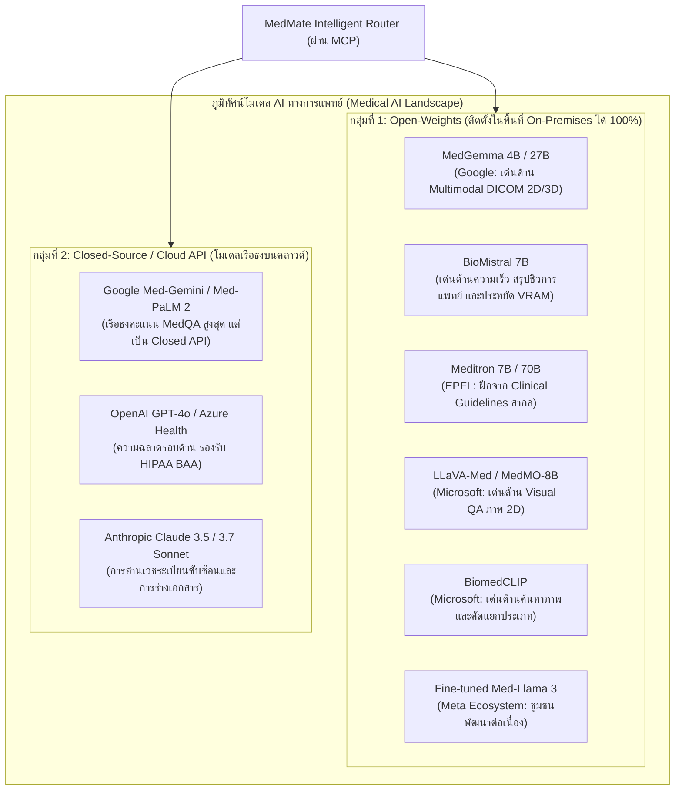
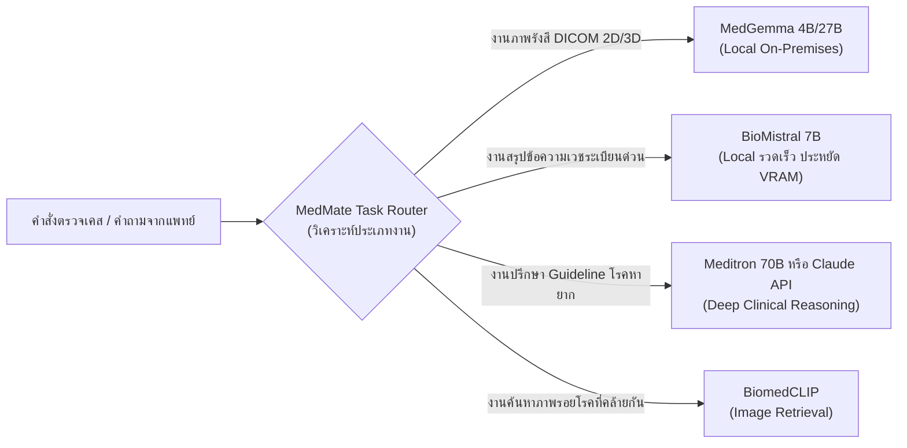
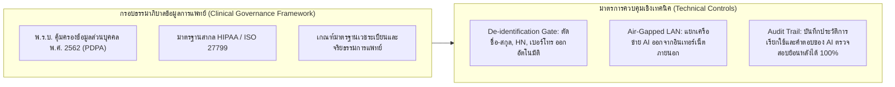
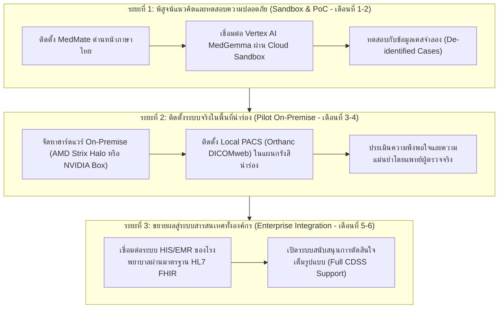
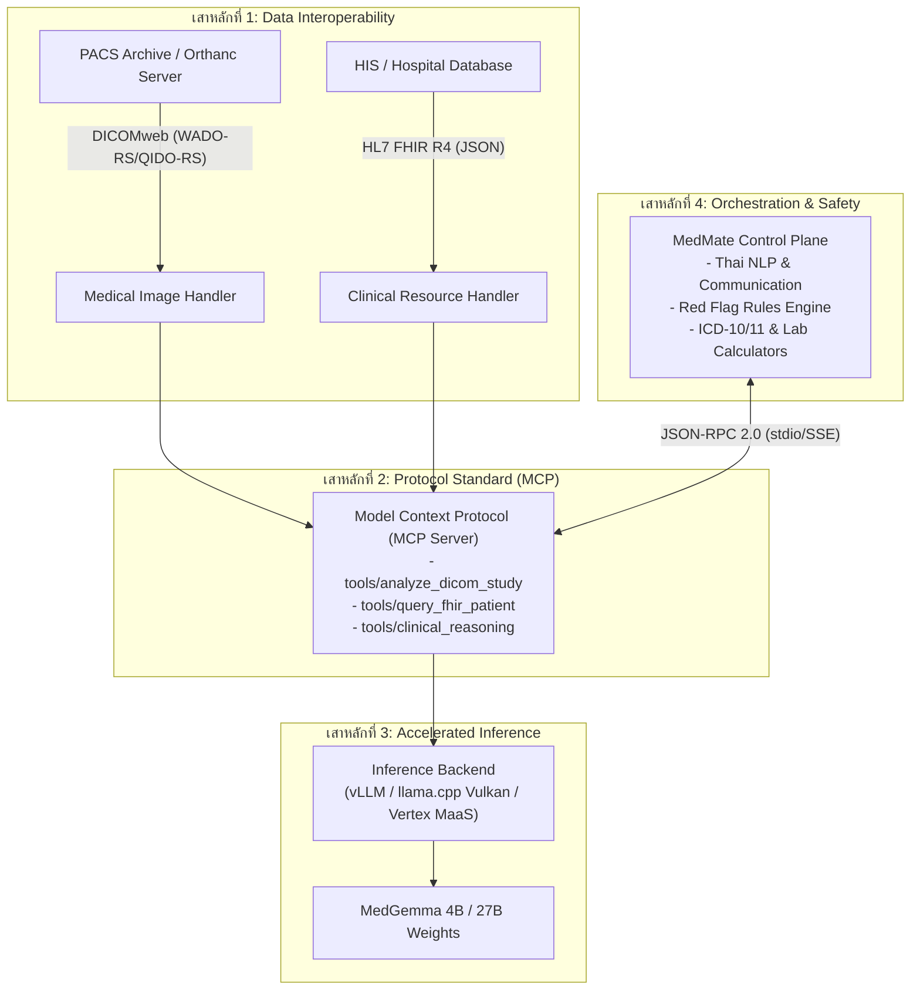
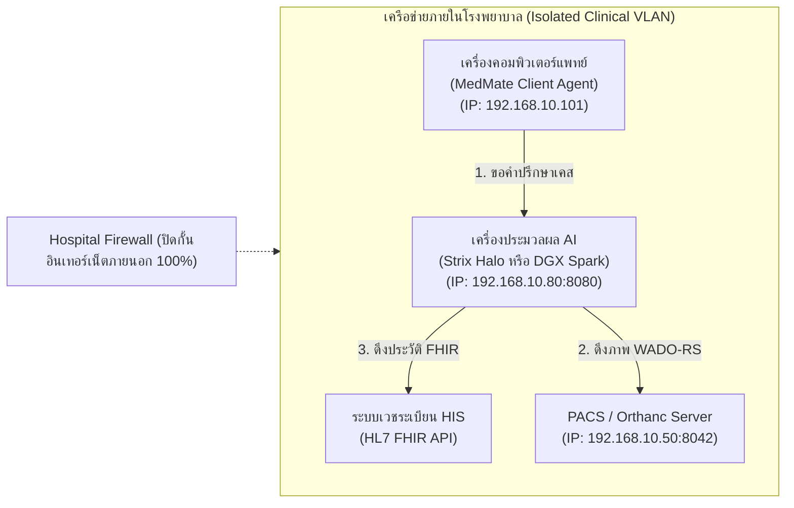

# แผนยุทธศาสตร์และสถาปัตยกรรมทางเทคนิค: การยกระดับระบบ MedMate ด้วยโมเดลการแพทย์ MedGemma
## (MedMate x MedGemma Integration Master Plan)

> **เอกสารสำหรับ:** คณะผู้บริหารระดับสูง (Hospital Director, CIO, CMO) และคณะทำงานดูแลระบบเทคโนโลยีสารสนเทศ (IT Administrators, Systems & Network Engineers)  
> **สถานะเอกสาร:** ข้อเสนอแนะเชิงยุทธศาสตร์และแผนปฏิบัติการทางเทคนิค (Comprehensive Proposal & Blueprint)  
> **วันที่จัดทำ:** 21 กันยายน 2026 (ปรับปรุงเพิ่มหัวข้อการวิเคราะห์โมเดลทางเลือก)  
> **การจำแนกชั้นความลับ:** เอกสารภายในสำหรับพิจารณาปรับปรุงระบบ (Internal Review Only)

---

## สรุปภาพรวมสำหรับผู้บริหาร (Executive Summary)

โครงการ **MedMate** มีเป้าหมายในการทำหน้าที่เป็นระบบตัวแทนอัจฉริยะทางการแพทย์ระดับคลินิก (Clinical Agent Orchestrator) ที่เน้นภาษาไทยเป็นหลัก (Thai-First) โดยมีจุดแข็งด้านการคัดกรองอาการฉุกเฉิน (Red Flags Emergency), การจัดโครงสร้างเวชระเบียน (Clinical NER), การคำนวณสูตรคลินิก และการสืบค้นองค์ความรู้เชิงประจักษ์ (PubMed, ICD-10/11)

รายงานฉบับนี้จัดทำขึ้นเพื่อนำเสนอ **"แผนการเชื่อมต่อและขยายขีดความสามารถด้วยโมเดล MedGemma"** ซึ่งเป็นโมเดลปัญญาประดิษฐ์ทางการแพทย์แบบเปิด (Open-Weights Medical Foundation Model) ที่พัฒนาโดย Google Health AI Developer Foundations บนสถาปัตยกรรม Gemma 3 พร้อมทั้งวิเคราะห์ **โมเดลทางการแพทย์ทางเลือกอื่นๆ ในตลาด (Alternative Medical AI Models & Competitors)** เพื่อให้คณะกรรมการมีข้อมูลประกอบการตัดสินใจรอบด้าน

### ประเด็นสำคัญเชิงยุทธศาสตร์:
1. **การก้าวข้ามข้อจำกัดด้านฮาร์ดแวร์ (Zero-Infrastructure Capable):** องค์กรไม่จำเป็นต้องมีซูเปอร์คอมพิวเตอร์หรือเซิร์ฟเวอร์ราคาแพงในระยะเริ่มต้น ระบบสามารถเชื่อมต่อประมวลผลผ่าน **Google Cloud Vertex AI Model Garden** ในรูปแบบ Model-as-a-Service (MaaS) ได้ทันทีโดยจ่ายตามการใช้งานจริง
2. **ทางเลือก On-Premises เพื่ออธิปไตยของข้อมูล (Data Sovereignty 100%):** หากองค์กรต้องการจัดหาฮาร์ดแวร์เองเพื่อรักษาความลับของคนไข้ตาม พ.ร.บ. คุ้มครองข้อมูลส่วนบุคคล (PDPA) และมาตรฐานสากล (HIPAA) ปัจจุบันมีตัวเลือกฮาร์ดแวร์ระดับปฏิวัติวงการอย่าง **AMD Strix Halo (Unified Memory 128GB)** และ **NVIDIA DGX Spark (GB10 Grace Blackwell)** ที่ช่วยให้รันโมเดลขนาดใหญ่ 27B ได้ในเครื่องขนาดกะทัดรัด ประหยัดพลังงาน และใช้งบประมาณต่ำกว่าเซิร์ฟเวอร์แบบเดิมหลายเท่า
3. **การเปิดกว้างต่อโมเดลทางเลือก (Agnostic Multi-Model Architecture):** การออกแบบระบบผ่านโปรโตคอล **Model Context Protocol (MCP)** ทำให้ MedMate ไม่ผูกขาดกับ MedGemma เพียงตัวเดียว แต่สามารถสลับหรือผสมผสานการใช้งานร่วมกับโมเดลการแพทย์ชั้นนำอื่น เช่น **BioMistral**, **Meditron**, **LLaVA-Med**, **BiomedCLIP**, ตลอดจนโมเดลเรือธงอย่าง **Med-Gemini** ได้อย่างยืดหยุ่น
4. **การยึดถือมาตรฐานสากล (Interoperability Standards):** การเชื่อมต่อจะไม่ใช้สคริปต์เฉพาะกิจ (Ad-hoc) แต่จะวางโครงสร้างบนมาตรฐานเปิดสากล 4 เสาหลัก ได้แก่ **DICOMweb (WADO-RS), HL7 FHIR R4, Model Context Protocol (MCP), และ Automated De-identification Pipeline**
5. **ความปลอดภัยทางคลินิก (Clinical Safety First):** โมเดล AI ทุกตัวจะถูกวางตำแหน่งเป็น **"ระบบสนับสนุนการตัดสินใจทางคลินิก (Clinical Decision Support System - CDSS)"** ภายใต้การควบคุมของแพทย์ (Human-in-the-Loop) โดยมี MedMate เป็นด่านหน้าตรวจจับสัญญาณชีพวิกฤตเสมอ

---

## 1. ข้อมูลพื้นฐาน: MedGemma คืออะไรและศักยภาพทางคลินิก

### 1.1 นิยามและสถาปัตยกรรมของ MedGemma
**MedGemma** เป็นชุดโมเดลภาษาและการมองเห็นขนาดใหญ่เฉพาะทางด้านการแพทย์ (Specialized Medical Multimodal LLM) ที่พัฒนาต่อยอดจากโครงสร้าง **Gemma 3** ภายใต้โครงการ Health AI Developer Foundations ของ Google โดยมีองค์ประกอบหลักดังนี้:
* **โมเดลขนาด 4B (Multimodal):** ได้รับการปรับแต่งคำสั่ง (Instruction-Tuned) ให้เข้าใจทั้งข้อความทางคลินิกและภาพถ่ายรังสีวินิจฉัย รองรับภาพความละเอียดสูง ภาพตัดขวาง 3 มิติ (3D CT/MRI volumes), ภาพชิ้นเนื้อพยาธิวิทยา (Whole-Slide Histopathology), และการเปรียบเทียบภาพเอกซเรย์ปอดข้ามช่วงเวลา (Longitudinal CXR)
* **โมเดลขนาด 27B (Text-First / Clinical Reasoning):** ออกแบบมาเพื่อการคิดวิเคราะห์เชิงคลินิกชั้นสูง (Deep Clinical Reasoning) การวิเคราะห์เคสผู้ป่วยโรคซับซ้อน และการสังเคราะห์แนวทางการรักษาจากประวัติเวชระเบียนหนาแน่น
* **MedSigLIP (400M parameters):** ตัวเข้ารหัสภาพการแพทย์ขั้นสูง (Vision Encoder) ที่ถูกฝึกฝนด้วยคู่ภาพและคำอธิบายรังสีวิทยา ช่วยจับความผิดปกติ รอยโรค และพิกัดกายวิภาค (Anatomical Localization) ได้แม่นยำสูง

### 1.2 ประสิทธิภาพการทดสอบทางการแพทย์ (Medical Benchmarks)
จากการทดสอบเปรียบเทียบกับเกณฑ์มาตรฐานทางการแพทย์ระดับสากล MedGemma ได้รับการพิสูจน์ถึงประสิทธิภาพที่โดดเด่น:
* **ความแม่นยำด้านข้อสอบแพทย์และเวชระเบียน:** ทำคะแนนทดสอบชุดข้อมูล **MedQA เพิ่มขึ้น 5%** และเพิ่มขึ้นถึง **22% บนชุดทดสอบ EHRQA** (Electronic Health Record Question Answering)
* **การจำแนกภาพรังสี 3 มิติ:** เพิ่มความแม่นยำในการจำแนกความผิดปกติของ **3D MRI Condition ขึ้น 11%**
* **งานพยาธิวิทยา:** ค่า Macro F1 เพิ่มขึ้น **47%** บนการตรวจวิเคราะห์สไลด์ชิ้นเนื้อขนาดใหญ่ (Whole-slide Pathology)
* **การสร้างรายงานรังสีวิทยา (Radiology Report Generation):** ทำคะแนน **RadGraph F1 ได้ถึง 30.3** ในการสังเคราะห์ผลอ่านภาพเอกซเรย์ทรวงอก (Chest X-ray)
* **การประเมินโดยแพทย์ผู้เชี่ยวชาญ (HealthBench):** ในการทดสอบประเมินเกณฑ์การส่งต่อผู้ป่วยฉุกเฉิน (Emergency Referral Criteria) และคุณภาพการสื่อสาร MedGemma 4B สามารถให้คำแนะนำที่สอดคล้องกับมาตรฐานทางคลินิกเทียบเท่าหรือดีกว่าโมเดลทั่วไปที่มีขนาดใหญ่กว่ามาก

### 1.3 กรณีตัวอย่างการนำไปใช้จริงในโรงพยาบาล (Hospital Real-World Use Cases)
1. **งานรังสีวินิจฉัยและการคัดกรองเร่งด่วน (Radiology Triage):** ช่วยจัดลำดับความเร่งด่วนของภาพถ่ายรังสี (CXR, CT Brain) ในห้องฉุกเฉิน โดยช่วยตรวจจับภาวะวิกฤตเบื้องต้น เช่น ลมรั่วในช่องเยื่อหุ้มปอด (Pneumothorax), ภาวะเลือดออกในสมอง (Intracranial Hemorrhage), หรือกระดูกหัก (Fractures) เพื่อแจ้งเตือนรังสีแพทย์ทันที
2. **การสกัดข้อมูลและจัดระเบียบเวชระเบียน (EHR Structuring & FHIR Navigation):** ช่วยอ่านบันทึกประวัติการตรวจแบบข้อความอิสระ (Unstructured Progress Notes) และผลตรวจทางห้องปฏิบัติการ เพื่อแปลงเป็นรหัสมาตรฐาน (ICD-10, LOINC) และสร้างเส้นเวลาประวัติการรักษา (Clinical Timeline)
3. **ระบบสนับสนุนการจัดเตรียมข้อมูลก่อนพบแพทย์ (Pre-consultation Summary):** สรุปประวัติย่อ ปัญหาสุขภาพเดิม รายการยาที่ใช้ และแนวโน้มผลแล็บที่ผิดปกติ เพื่อให้แพทย์ผู้ตรวจเห็นภาพรวมได้ภายใน 30 วินาที

### 1.4 ขอบเขตความปลอดภัยและข้อจำกัดทางกฎหมาย (Legal & Safety Boundary)
* **เครื่องมือสนับสนุน ไม่ใช่เครื่องมือวินิจฉัยขั้นสุดท้าย:** MedGemma เป็นซอฟต์แวร์สนับสนุนการตัดสินใจทางคลินิก (Non-diagnostic Clinical Decision Support) ไม่ได้รับอนุญาตให้ทำหน้าที่วินิจฉัยโรค สั่งการรักษา หรือระบุการจ่ายยาโดยปราศจากการตรวจสอบของแพทย์ผู้มีใบอนุญาตประกอบวิชาชีพ
* **ข้อจำกัดด้านการสนทนาทั่วไป:** โมเดลถูกปรับแต่งมาเพื่องานด้านข้อมูลการแพทย์เฉพาะจุด จึงไม่เหมาะกับการนำไปเป็นแชตบอตพูดคุยทั่วไปแบบเปิดกว้าง (Open-ended general conversation) โดยไม่มี Guardrails กำกับ

---

## 2. ทางเลือก Model อื่น: การวิเคราะห์เปรียบเทียบในระบบนิเวศ Medical AI
*(วิเคราะห์ข้อมูลสืบค้นเชิงลึก: "MedGemma มีคู่แข่งไหม และมีทางเลือกอื่นอย่างไร")*

ในการวางแผนพัฒนาระบบระดับองค์กร ผู้บริหารและผู้ดูแลระบบจำเป็นต้องทราบถึง **ภูมิทัศน์ของโมเดลปัญญาประดิษฐ์ทางการแพทย์ (Medical AI Landscape)** ทั้งหมด เพื่อป้องกันภาวะพึ่งพิงเทคโนโลยีเพียงรายเดียว (Vendor Lock-in) และเลือกใช้เครื่องมือที่เหมาะสมกับแต่ละงานย่อยได้อย่างคุ้มค่าสูงสุด:



### 2.1 กลุ่มที่ 1: Open-Weights / Self-Hosted Models (คู่แข่งตรงสำหรับติดตั้ง On-Premises)
โมเดลกลุ่มนี้เปิดเผยค่าน้ำหนัก (Weights) องค์กรสามารถดาวน์โหลดมารันบนเครื่องเซิร์ฟเวอร์หรือ Workstation ในโรงพยาบาลได้เอง ข้อมูลผู้ป่วยจึงไม่ออกสู่อินเทอร์เน็ต:

1. **BioMistral 7B:**
   * **จุดเด่น:** พัฒนาต่อยอดจาก Mistral 7B ฝึกฝนด้วยเอกสารทางชีวการแพทย์และงานวิจัยจาก PubMed Central (PMC) เป็นโมเดลยอดนิยมสูงสุดตัวหนึ่งในกลุ่มโอเพนซอร์ส
   * **ข้อได้เปรียบ:** ขนาดเล็ก กินทรัพยากรน้อยมาก รันบนการ์ดจอระดับเริ่มต้น (RTX 4060 Ti 16GB หรือแรมระบบ 16GB) ได้รวดเร็วมาก เหมาะกับงานสรุปเวชระเบียนและตอบคำถามข้อความภาษาอังกฤษ
   * **ข้อจำกัด:** เป็นโมเดลข้อความล้วน (Text-only) **ไม่รองรับภาพถ่ายรังสี (DICOM)**
2. **Meditron (7B และ 70B):**
   * **จุดเด่น:** พัฒนาโดยสถาบันวิจัย EPFL สวิตเซอร์แลนด์ บนฐาน Llama ฝึกฝนด้วยแนวทางเวชปฏิบัติสากล (Clinical Guidelines เช่น WHO, UpToDate, คลังหนังสือแพทย์)
   * **ข้อได้เปรียบ:** มีความน่าเชื่อถือสูงในแง่ของ Evidence-based Medicine และการให้คำแนะนำสอดคล้องกับ Guideline สากล
   * **ข้อจำกัด:** เป็นโมเดลข้อความล้วน และรุ่น 70B ต้องการ VRAM สูง (อย่างน้อย 40GB+ ในโหมด INT4 หรือเซิร์ฟเวอร์การ์ดคู่)
3. **LLaVA-Med & MIM-LLaVA-Med:**
   * **จุดเด่น:** พัฒนาโดย Microsoft Research ร่วมกับสถาบันพันธมิตร ต่อยอดจากสถาปัตยกรรม LLaVA ฝึกฝนด้วยคู่ภาพและคำอธิบายทางการแพทย์ 15 ล้านคู่ (PMC-15M)
   * **ข้อได้เปรียบ:** มีความเชี่ยวชาญด้านการถาม-ตอบเกี่ยวกับภาพทางการแพทย์ (Biomedical Visual Question Answering - VQA)
   * **ข้อจำกัด:** ถูกออกแบบมาเพื่องานวิจัยเป็นหลัก รองรับภาพ 2D เป็นส่วนใหญ่ ยังไม่รองรับภาพตัดขวาง 3D ปริมาตรหนา (เช่น 3D CT/MRI volumes) ได้ดีเท่า MedGemma
4. **BiomedCLIP:**
   * **จุดเด่น:** โมเดลจับคู่ภาพและข้อความชีวการแพทย์ (Vision-Language Alignment) จาก Microsoft
   * **ข้อได้เปรียบ:** เหมาะอย่างยิ่งสำหรับงาน **Cross-Modal Retrieval** (เช่น แพทย์ต้องการค้นหาภาพรังสีในคลังที่มีลักษณะรอยโรคคล้ายกับภาพคนไข้ปัจจุบัน) และการทำ Zero-shot Image Classification
   * **ข้อจำกัด:** ไม่ใช่โมเดลสนทนาหรือวิเคราะห์เหตุผลเชิงลึก (ไม่ใช่ LLM ในตัว)
5. **MedMO-8B:**
   * **จุดเด่น:** โมเดล Multimodal ยุคใหม่ที่ออกแบบมาเพื่อการสังเคราะห์ภาพความละเอียดสูงร่วมกับข้อความคำสั่ง รองรับงานอ่านภาพและการวิเคราะห์คลินิกร่วมสมัย

### 2.2 กลุ่มที่ 2: Closed-Source / Enterprise Frontier APIs (โมเดลเรือธงบนคลาวด์)
โมเดลกลุ่มนี้มีความสามารถในการวิเคราะห์เหตุผลระดับสูงสุด แต่จำเป็นต้องส่งข้อมูลผ่านระบบคลาวด์ภายนอก:

1. **Google Med-Gemini / Med-PaLM 2:**
   * **จุดเด่น:** โมเดลการแพทย์ที่ดีที่สุดของ Google ทำคะแนนทดสอบ MedQA ได้สูงกว่า 90% และมีความสามารถด้านรังสีวิทยา พยาธิวิทยา และพันธุศาสตร์ในระดับแนวหน้าของโลก
   * **ข้อจำกัด:** เป็นกรรมสิทธิ์ปิด (Proprietary) ไม่สามารถนำน้ำหนักโมเดลมาติดตั้ง On-Premises ได้ ต้องใช้งานผ่าน Google Cloud Healthcare API และมีค่าบริการตามปริมาณการใช้งาน
2. **OpenAI GPT-4o / Azure OpenAI Healthcare:**
   * **จุดเด่น:** ฉลาดรอบด้าน มีความสามารถด้านภาษาไทยที่ดีเยี่ยม และรองรับภาพถ่ายทั่วไปได้ดี มีข้อตกลงคุ้มครองข้อมูลการแพทย์ (HIPAA BAA) บน Microsoft Azure
   * **ข้อจำกัด:** ไม่ได้ถูกเทรนมาเฉพาะเจาะจงกับภาพถ่าย DICOM ทางการแพทย์แบบ 3 มิติ และมีค่าใช้จ่ายผันแปรตามปริมาณการใช้งาน
3. **Anthropic Claude 3.5 / 3.7 Sonnet:**
   * **จุดเด่น:** มีความสามารถในการวิเคราะห์เอกสารเวชระเบียนที่ซับซ้อนและยาวมาก (Context Window 200,000 โทเคน) ได้อย่างแม่นยำ ปฏิบัติตามคำสั่งทางการแพทย์ได้อย่างปลอดภัย
   * **ข้อจำกัด:** เป็น Cloud API ไม่สามารถดาวน์โหลดมารันแบบ Air-gapped ภายในองค์กรได้

### 2.3 ตารางเปรียบเทียบเชิงลึก: MedGemma ปะทะ โมเดลทางเลือกในตลาด

| คุณลักษณะ (Features) | Google MedGemma (4B / 27B) | BioMistral (7B) | Meditron (7B / 70B) | LLaVA-Med (7B) | Google Med-Gemini | OpenAI GPT-4o |
| :--- | :--- | :--- | :--- | :--- | :--- | :--- |
| **ประเภทโมเดล** | **Open-Weights** | Open-Weights | Open-Weights | Open-Weights | Closed API (Cloud) | Closed API (Cloud) |
| **การรองรับภาพ (Multimodal)** | **รองรับเต็มรูปแบบ (DICOM 2D/3D, CXR, MRI, WSI)** | ไม่รองรับ (Text Only) | ไม่รองรับ (Text Only) | รองรับ (เน้น 2D Biomedical VQA) | รองรับระดับสูงสุด (2D/3D/Genomics) | รองรับภาพทั่วไป (JPEG/PNG) |
| **การติดตั้งในพื้นที่ (On-Premises)** | **ทำได้ 100% (Air-Gapped LAN)** | ทำได้ 100% | ทำได้ 100% | ทำได้ 100% | ไม่ได้ (ต้องต่อคลาวด์) | ไม่ได้ (ต้องต่อคลาวด์) |
| **ความต้องการ VRAM** | 4B: 6–10GB<br/>27B: 16–48GB | **ประหยัดมาก: 6–12GB** | 7B: 8–14GB<br/>70B: 40–80GB | 8–16GB | ไม่ต้องใช้ฮาร์ดแวร์ในพื้นที่ | ไม่ต้องใช้ฮาร์ดแวร์ในพื้นที่ |
| **จุดเด่นที่เหมาะสมที่สุด** | **ภาพถ่ายรังสีวิทยา และการสืบค้นประวัติ FHIR** | **ค้นคว้าชีวการแพทย์ และสรุปประวัติข้อความ** | **แนวทางเวชปฏิบัติ (Clinical Guidelines)** | **งานวิจัย Visual QA สำหรับภาพการแพทย์** | **เคสซับซ้อนระดับสูงสุดขององค์กรใหญ่** | **ความฉลาดรอบด้าน และความเชี่ยวชาญภาษาไทย** |

### 2.4 กลยุทธ์การใช้งานแบบผสมผสาน (Hybrid Multi-Model Strategy ผ่าน MedMate MCP)
ด้วยสถาปัตยกรรมของ MedMate ที่เชื่อมต่อเครื่องมือผ่าน **Model Context Protocol (MCP)** องค์กรไม่จำเป็นต้องเลือกโมเดลใดโมเดลหนึ่งเพียงตัวเดียว แต่สามารถตั้งค่า **"ตัวสลับโมเดลอัจฉริยะ (Intelligent Model Router)"** ให้เลือกใช้โมเดลที่เหมาะสมที่สุดตามโจทย์:



---

## 3. ส่วนสำหรับผู้บริหาร: การวิเคราะห์เชิงกลยุทธ์และการตัดสินใจ

### 3.1 การวิเคราะห์ต้นทุนรวมและการลงทุน (TCO: CapEx vs. OpEx Analysis)

ผู้บริหารสามารถเลือกรูปแบบการลงทุนได้ตามนโยบายงบประมาณขององค์กร:

| มิติการเปรียบเทียบ | ทางเลือกที่ 1: Cloud-Native (Google Cloud Vertex AI) | ทางเลือกที่ 2: On-Premises Workstation (AMD Strix Halo) | ทางเลือกที่ 3: On-Premises Server (NVIDIA DGX Spark / RTX 4090) |
| :--- | :--- | :--- | :--- |
| **ลักษณะงบประมาณ** | **OpEx** (จ่ายตามการใช้งานจริง) | **CapEx** (ลงทุนซื้อเครื่องครั้งเดียว) | **CapEx** (ลงทุนซื้อเครื่องครั้งเดียว) |
| **ค่าใช้จ่ายเริ่มต้น** | 0 บาท (มีเครดิตทดลองใช้ \$300) | ประมาณ 70,000 – 110,000 บาท/เครื่อง | ประมาณ 120,000 – 250,000 บาท/เครื่อง |
| **ค่าใช้จ่ายต่อเนื่อง** | ค่าประมวลผลต่อนาที/โทเคน + ค่าพื้นที่เก็บข้อมูล | ค่าไฟฟ้าตามจริง (~50–120 วัตต์) | ค่าไฟฟ้าตามจริง (~150–450 วัตต์) |
| **ความพร้อมในการเริ่มงาน** | **ทันที (ภายใน 1 สัปดาห์)** | 2–4 สัปดาห์ (จัดซื้อและติดตั้งระบบ) | 2–6 สัปดาห์ (จัดซื้อและติดตั้งระบบ) |
| **ความเสี่ยงทางการเงิน** | ต่ำ (ยกเลิกหรือปิดบริการได้ทุกเมื่อ) | ต่ำ-ปานกลาง (ฮาร์ดแวร์นำไปใช้งานอื่นได้) | ปานกลาง (ต้องมีผู้ดูแลเฉพาะทาง) |
| **ความคุ้มค่าระยะยาว** | เหมาะกับโหลดงานที่ไม่แน่นอนหรือช่วงนำร่อง | คุ้มค่าสูงสุดสำหรับคลินิก/ห้องตรวจประจำ | คุ้มค่าสูงสุดสำหรับแผนกรังสีที่มีคิวตรวจหนาแน่น |

### 3.2 การประเมินความเสี่ยงและธรรมาภิบาลข้อมูล (Risk Governance & Compliance)



* **การปฏิบัติตาม PDPA และ HIPAA:** 
  * หากเลือก **On-Premises**: ข้อมูลภาพและเวชระเบียนจะถูกประมวลผลอยู่ภายในเครือข่ายความปลอดภัยสูงของโรงพยาบาล (Intranet / Private Subnet) ไม่มีการส่งข้อมูลข้ามพรมแดน ทำให้ผ่านการประเมินผลกระทบด้านการคุ้มครองข้อมูลส่วนบุคคล (DPIA) ได้โดยง่าย
  * หากเลือก **Cloud**: บังคับใช้ **Cloud Healthcare Automated De-identification Pipeline** เพื่อลบชื่อ, เลขประจำตัวผู้ป่วย (HN), วันเดือนปีเกิด และข้อมูลประจำตัวผู้ป่วยออกจาก DICOM Tag และเนื้อหาเวชระเบียนอย่างสมบูรณ์ก่อนส่งเข้าโมเดล
* **สิทธิการถือครองข้อมูล (Data Sovereignty):** โรงพยาบาลคงสิทธิ์ในการเป็นเจ้าของข้อมูล 100% และตามเงื่อนไขของ Google Cloud / Open Weights จะไม่มีการนำข้อมูลผู้ป่วยไปใช้ฝึกฝนโมเดลสาธารณะ (No Training on Customer Data)

### 3.3 แผนที่นำทางเชิงยุทธศาสตร์ 3 ระยะ (3-Phase Strategic Roadmap)



---

## 4. ส่วนสำหรับผู้ดูแลระบบ: สถาปัตยกรรมทางเทคนิคและวิศวกรรมระบบ

### 4.1 สี่เสาหลักทางเทคโนโลยี (The 4 Modern Pillars)

สถาปัตยกรรมระดับโปรดักชันของ MedMate x MedGemma ปฏิเสธการเขียนสคริปต์เชื่อมต่อแบบเฉพาะกิจ (Ad-hoc REST API) โดยออกแบบบน 4 เสาหลักทางเทคโนโลยี:



1. **Pillar 1: Data Interoperability (DICOMweb & FHIR R4):** 
   * สตรีมภาพรังสีผ่านโปรโตคอล **WADO-RS (Web Access to DICOM Persistent Objects via RESTful Web Services)** ทำให้ดึงเฉพาะเฟรมหรือสไลซ์ที่ต้องการได้ ไม่ต้องโหลดทั้งการตรวจ (Study)
   * แลกเปลี่ยนข้อมูลประวัติผู้ป่วยด้วยมาตรฐาน **HL7 FHIR Release 4**
2. **Pillar 2: Agent Standard Protocol (MCP - Model Context Protocol):**
   * ห่อหุ้มความสามารถของ MedGemma ให้อยู่ในรูป **MCP Server (`medgemma-mcp`)** สื่อสารด้วยรูปแบบ JSON-RPC 2.0
   * ส่งผลให้โมเดลกลายเป็นเครื่องมือสากลที่สามารถปลั๊กเข้ากับ Agent ใดๆ ในองค์กรได้ทันทีโดยไม่ต้องแก้โค้ดภายใน
3. **Pillar 3: High-Performance Inference Engine:**
   * รองรับการทำงานแบบสองระบบ: ใช้ **vLLM** (พร้อม PagedAttention บน NVIDIA) หรือ **llama.cpp / Ollama** (พร้อม Vulkan RADV Backend บน AMD Strix Halo)
4. **Pillar 4: Split-Plane Architecture (สถาปัตยกรรมแยกส่วนควบคุมและการประมวลผล):**
   * **Control Plane (MedMate):** รับคำถาม คัดกรองอาการวิกฤต (Red Flag ฉุกเฉิน) สื่อสารภาษาไทย บังคับใช้การแสดงผลแบบตาราง Markdown และสืบค้น Local RAG
   * **Inference Plane (MedGemma):** ประมวลผลภาพทางการแพทย์เชิงลึกและการวิเคราะห์ทางคลินิกที่ซับซ้อน

---

## 5. การเปรียบเทียบและการคัดเลือกฮาร์ดแวร์อย่างละเอียด (Hardware Matrix)

### 5.1 ตารางเปรียบเทียบข้อกำหนดฮาร์ดแวร์เชิงลึก

| คุณลักษณะ (Features) | ทางเลือก A: Cloud (Vertex AI) | ทางเลือก B: AMD Strix Halo (Ryzen AI Max 395) | ทางเลือก C: NVIDIA DGX Spark (GB10 Blackwell) | ทางเลือก D: NVIDIA Workstation (RTX 4090 24GB) |
| :--- | :--- | :--- | :--- | :--- |
| **สถาปัตยกรรมชิป** | Google Cloud TPU / NVIDIA Cloud GPUs | APU: x86-64 (Zen 5) + RDNA 3.5 GPU (40 CUs) | Superchip: Arm (Grace 20 Cores) + Blackwell GPU | แยก CPU x86 + การ์ดจอแยก (dGPU) Ada Lovelace |
| **หน่วยความจำสำหรับ AI (VRAM)** | จัดสรรได้ยืดหยุ่นตามความต้องการ | **Unified Memory สูงสุด 128 GB LPDDR5X** | **Unified Memory 128 GB LPDDR5X** | **24 GB GDDR6X** (จำกัดเฉพาะบนตัวการ์ด) |
| **แบนด์วิธหน่วยความจำ (Bandwidth)** | สูงมากบนโครงสร้างพื้นฐานคลาวด์ | **~273 GB/s** (บัส 256-bit) | **สูงมาก** (สถาปัตยกรรม Blackwell) | **~1,008 GB/s** (บัส 384-bit) |
| **โมเดลที่รองรับได้สมบูรณ์** | MedGemma 4B และ 27B ทุกขนาด | **MedGemma 27B (FP16/INT8/INT4)** | **MedGemma 27B (FP16/INT8/INT4)** | MedGemma 4B (FP16) หรือ MedGemma 27B (เฉพาะ INT4) |
| **รองรับภาพ DICOM หลายสไลซ์** | สูงมาก | **ยอดเยี่ยม** (มีแรมเหลือรองรับ Context ยาว) | **ยอดเยี่ยม** (มีแรมเหลือรองรับ Context ยาว) | ปานกลาง (อาจติดเพดาน VRAM 24GB ในเคส CT หนา) |
| **การใช้พลังงานทั้งระบบ (TDP)** | ไม่ใช้อุปกรณ์ในพื้นที่ | **55W – 120W (ประหยัดพลังงานสูงมาก)** | **~70W – 140W (ประหยัดพลังงานสูง)** | **450W – 600W (ความร้อนและการกินไฟสูง)** |
| **ระบบปฏิบัติการที่รองรับ** | เข้าถึงผ่าน REST API ได้ทุก OS | **Windows 11 และ Linux x86 ทั่วไป** | **NVIDIA DGX OS (Ubuntu Linux เฉพาะทาง)** | Windows 11 และ Linux ทั่วไป |
| **ระบบนิเวศซอฟต์แวร์ AI** | Pre-built Google Container ทันที | **Vulkan / ROCm** (ต้องใช้ `llama.cpp` / GGUF) | **CUDA / TensorRT-LLM / NIM แท้ 100%** | **CUDA / TensorRT-LLM แท้ 100%** |
| **ความสะดวกในการนำไปใช้** | ใช้งานได้ทันที | ใช้งานเป็นทั้ง PC ตรวจโรคและ AI Box ในตัว | เป็น Dedicated AI Server ประสิทธิภาพสูง | ติดตั้งง่าย มีไดรเวอร์และคอมมูนิตี้รองรับสูงสุด |

### 5.2 บทวิเคราะห์เชิงลึก: AMD Strix Halo vs. ผลิตภัณฑ์ของ NVIDIA
1. **AMD Strix Halo (Ryzen AI Max 395):**
   * **จุดแข็งที่สุด:** ได้รับสถาปัตยกรรม **Unified Memory สูงถึง 128GB** บนชิป x86 ทำให้สามารถโหลดโมเดล MedGemma 27B ขนาดเต็มพร้อมบัฟเฟอร์ภาพ DICOM ขนาดยักษ์ได้โดยไม่ต้องกังวลเรื่อง VRAM ล้น ในงบประมาณที่คุ้มค่า และเครื่องมีขนาดเล็ก เงียบ เหมาะกับห้องตรวจ
   * **ข้อจำกัดทางเทคนิค:** สถาปัตยกรรม RDNA 3.5 (`gfx1151`) ยังไม่รองรับชุดคำสั่ง FP8 แบบ Native และไม่สามารถรัน Docker Image ต้นฉบับที่เป็น CUDA ของ Google ได้โดยตรง ผู้ดูแลระบบต้องใช้แบ็กเอนด์ **`llama.cpp` ผ่าน Vulkan (RADV)** และแปลงโมเดลเป็นฟอร์แมต `.gguf`
2. **NVIDIA DGX Spark (ชิป GB10 Grace Blackwell):**
   * **จุดแข็งที่สุด:** เป็นคอมพิวเตอร์ซูเปอร์เดสก์ท็อปขนาดเท่าฝ่ามือที่มี Unified Memory 128GB เช่นกัน แต่ได้เปรียบสูงสุดในด้าน **ความเข้ากันได้กับซอฟต์แวร์ (100% CUDA Native)** สามารถรัน Docker Image ของ MedGemma จาก Google, TensorRT-LLM, และ NVIDIA NIM ได้ทันทีโดยไม่ต้องปรับแต่งโค้ด
   * **ข้อจำกัดทางเทคนิค:** ตัวประมวลผลเป็นชิป ARM รันบน DGX OS จึงถูกออกแบบมาให้เป็น "Dedicated AI Appliance" มากกว่าที่จะนำมาเปิดใช้งานโปรแกรมตรวจคนไข้ทั่วไปของ Windows
3. **ข้อจำกัดของ แล็ปท็อป/PC การ์ดจอแยก NVIDIA ทั่วไป:**
   * การ์ดจอเกมมิ่งหรือการ์ดจอแยกในแล็ปท็อป (เช่น RTX 4080/4090 Mobile) มี VRAM ถูกจำกัดอยู่ที่ **16GB** เท่านั้น แม้เครื่องจะมี RAM ระบบ 64GB แต่การ์ดจอไม่สามารถสลับข้อมูลผ่านบัส PCIe ได้เร็วพอ ทำให้ไม่สามารถรันโมเดล MedGemma 27B ร่วมกับการอ่านภาพหลายภาพได้อย่างมีประสิทธิภาพ

---

## 6. คู่มือปฏิบัติการสำหรับผู้ดูแลระบบ (DevOps & Implementation Runbook)

### 6.1 ผังการเชื่อมต่อเครือข่ายภายในโรงพยาบาล (Network Topology)



### 6.2 ขั้นตอนการติดตั้ง Local Infrastructure ทีละขั้นตอน

#### ขั้นที่ 1: ติดตั้ง Local PACS (Orthanc DICOMweb Server)
ติดตั้ง Orthanc บนเครื่องเซิร์ฟเวอร์หรือ Docker เพื่อทำหน้าที่เป็นคลังภาพรังสีส่วนกลาง:
```bash
# ตัวอย่าง Docker Compose สำหรับติดตั้ง Orthanc พร้อมปลั๊กอิน DICOMweb
version: '3.8'
services:
  orthanc:
    image: orthancteam/orthanc:latest
    ports:
      - "4242:4242" # DICOM port
      - "8042:8042" # DICOMweb / REST API port
    environment:
      ORTHANC_JSON: |
        {
          "Name": "Hospital_Local_PACS",
          "DicomWeb": {
            "Enable": true,
            "Root": "/dicom-web/"
          }
        }
    volumes:
      - ./orthanc_db:/var/lib/orthanc/db
```

#### ขั้นที่ 2: ตั้งค่า Inference Engine สำหรับ MedGemma
* **กรณีใช้ AMD Strix Halo (Vulkan + llama.cpp):**
  1. ติดตั้งไดรเวอร์ Mesa และเครื่องมือ Vulkan RADV
  2. ดาวน์โหลดโมเดล `medgemma-27b-it.Q4_K_M.gguf` และไฟล์โปรเจกเตอร์ภาพ `mmproj-medgemma-27b-f16.gguf`
  3. สั่งรันเซิร์ฟเวอร์ด้วยคำสั่ง:
     ```bash
     ./llama-server \
       --model ./models/medgemma-27b-it.Q4_K_M.gguf \
       --mmproj ./models/mmproj-medgemma-27b-f16.gguf \
       --host 0.0.0.0 --port 8080 \
       -ngl 99 --ctx-size 16384
     ```
* **กรณีใช้ NVIDIA DGX Spark / RTX 4090 (vLLM / Google Official Docker):**
  1. ติดตั้ง NVIDIA Driver และ NVIDIA Container Toolkit
  2. สั่งรัน vLLM รองรับการประมวลผล Multimodal:
     ```bash
     python3 -m vllm.entrypoints.openai.api_server \
       --model google/medgemma-27b-it \
       --tensor-parallel-size 1 \
       --trust-remote-code \
       --host 0.0.0.0 --port 8080
     ```

#### ขั้นที่ 3: กำหนดค่า MCP Server ใน MedMate (`medgemma-mcp`)
กำหนดค่าในไฟล์คอนฟิกของ MedMate (`settings.json` หรือ `mcp_config.json`):
```json
{
  "mcpServers": {
    "medgemma-mcp": {
      "command": "python",
      "args": ["-m", "medical_skill.medgemma_mcp_server"],
      "env": {
        "MEDGEMMA_ENDPOINT": "http://192.168.10.80:8080/v1",
        "ORTHANC_DICOMWEB_URL": "http://192.168.10.50:8042/dicom-web",
        "DEIDENTIFICATION_STRICT": "true"
      }
    }
  }
}
```

### 6.3 มาตรการความปลอดภัยและแผนกู้คืนระบบ (Security & DR)
1. **Network Segmentation:** เครื่องประมวลผล AI และ Local PACS จะต้องอยู่บน Medical Device VLAN ที่มี Access Control List (ACL) ห้ามการเชื่อมต่อตรงจากอินเทอร์เน็ตสาธารณะ
2. **Access Control:** การเรียกใช้งานเครื่องมือผ่าน MCP ต้องยืนยันตัวตนผ่าน Token หรือ TLS Client Certificate
3. **Disaster Recovery (DR Plan):** 
   * ทำ Snapshot ของระบบโมเดลและคอนฟิกเก็บไว้ใน Cold Storage
   * หากเครื่องประมวลผล AI ในพื้นที่ขัดข้อง ระบบ MedMate มีความสามารถในการสลับเส้นทาง (Fallback Routing) กลับไปใช้โมเดลสืบค้นความรู้ข้อความพื้นฐาน หรือสลับไปใช้ Cloud Vertex AI ชั่วคราวได้

---

## 7. สรุปข้อเสนอแนะและมติการตัดสินใจ (Final Decision Matrix)

| สถานการณ์ขององค์กร | ข้อเสนอแนะแนวทางที่ควรเลือก | เหตุผลสนับสนุน |
| :--- | :--- | :--- |
| **ระยะเร่งด่วน / ต้องการทดสอบทันที / งบประมาณจำกัด** | **ทางเลือก A: Google Cloud Vertex AI** | ไม่ต้องลงทุนฮาร์ดแวร์ล่วงหน้า เริ่มงานได้ภายใน 3 วัน ประเมินความพึงพอใจของแพทย์ก่อนลงทุนใหญ่ |
| **คลินิก / ห้องตรวจแพทย์ / ต้องการความคล่องตัวและประหยัดไฟ** | **ทางเลือก B: AMD Strix Halo (128GB RAM)** | เครื่องขนาดกะทัดรัด (Mini PC) ประหยัดไฟมาก รันโมเดล 27B พร้อมภาพตัดขวางได้ในราคาประหยัดที่สุด |
| **แผนกรังสีวินิจฉัยหลัก / ต้องการความง่ายระดับ Enterprise** | **ทางเลือก C: NVIDIA DGX Spark หรือ Workstation** | ได้ระบบนิเวศ CUDA แท้ 100% รันอิมเมจจาก Google ได้ทันที รองรับโหลดงานรังสีแพทย์ได้อย่างต่อเนื่อง |

---

> 💡 **คำแนะนำสำหรับการพิมพ์หรือแปลงเป็น PDF (Printing & PDF Export Guide):**  
> เอกสารแผนพัฒนาระบบนี้ถูกจัดทำในรูปแบบ Markdown (`.md`) มาตรฐานสากล เพื่อรักษาความถูกต้องของสูตรคำนวณและแผนภาพสถาปัตยกรรม ($\LaTeX$ และ Mermaid) ได้อย่างแม่นยำสูงสุด  
> หากต้องการพิมพ์เป็นเอกสารเสนอคณะกรรมการ หรือบันทึกเป็นไฟล์ PDF แนะนำให้เปิดไฟล์ ผ่านโปรแกรมต่อไปนี้:  
> 1. **Obsidian** (ฟรี - แนะนำสูงสุด): เปิดไฟล์ `.md` แล้วเลือกคำสั่ง `Export to PDF` (รองรับภาษาไทย แผนภาพ Mermaid และสูตร $\LaTeX$ อัตโนมัติ 100%)  
> 2. **VS Code**: ติดตั้งส่วนขยาย *Markdown PDF* หรือ *Markdown Preview Enhanced* แล้วคลิกขวาเลือก `Export (pdf)`  
> 3. **Typora**: เลือกเมนู `File -> Export -> PDF` เพื่อจัดหน้าเอกสารให้สวยงามตามมาตรฐานงานสารบรรณ  
> 4. **Google Chrome / Microsoft Edge**: ติดตั้ง Extension *Markdown Viewer* หรือเปิดดูผ่าน GitHub แล้วกดพิมพ์ `Ctrl + P` (Print -> Save as PDF)
